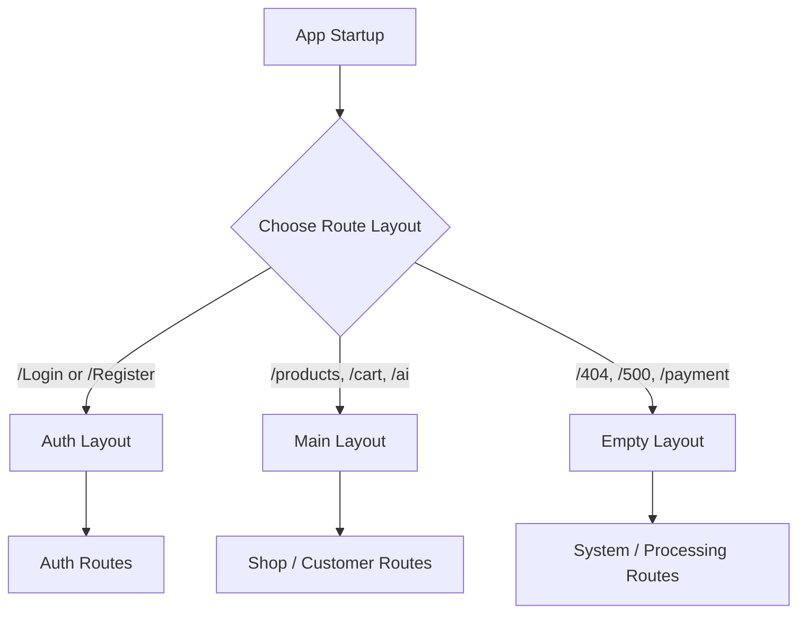
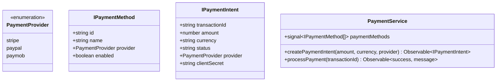

# Technical Architecture & System Documentation
## Project: FurniMind AI (Angular 20 Enterprise Portal)

This documentation provides an in-depth analysis and onboarding guide for the enterprise architecture of **FurniMind AI**, a premium furniture marketplace integrated with spatial artificial intelligence. This document is written for developers, engineering leads, and stakeholders to understand the structure, data flows, and coding standards of the application.

---

## 1. Project Overview

### Project Purpose & Business Idea
**FurniMind AI** is an advanced enterprise-grade e-commerce application designed to revolutionize the way users browse, customize, and purchase furniture. The core value proposition centers around bridging standard retail commerce with **spatial artificial intelligence**. Key functionalities include:
1. **Premium Marketplace**: Browse and filter catalog items, purchase furniture, and save favorites.
2. **Spatial AI Integration**: Users can upload room photos or scan spaces to receive real-time 3D coordinate placement suggestions (`x`, `y`, `z` coordinates with `pitch`, `yaw`, `roll` rotations) for selected furniture items.
3. **Multi-Provider Payments**: Highly scalable checkout flows supporting Stripe, PayPal, and Paymob.
4. **Seamless Internationalization**: Complete English/Arabic language swapping, adjusting structural directionality (LTR/RTL) reactively.

### Technology Stack
* **Framework**: **Angular 20.3.0** (Standalone Components, modern Functional Guards/Interceptors, and fine-grained Reactivity with Signals).
* **Styles**: **Bootstrap 5.3.8** (Grid & utilities) combined with custom **Premium CSS Variables & Animations** (smooth bezier transitions, premium visual components).
* **Build System**: **Angular CLI 20.3.24** & Dev-server.
* **Server-Side Rendering**: **Angular SSR (@angular/ssr 20.3.24)** utilizing Express 5.1.0 to handle Server rendering, hydration, and event replay.
* **Reactivity & HTTP**: **RxJS 7.8.0** coupled with Angular Signals.

### Architecture Style
The project adheres to a **Feature-first Layered Architecture**, incorporating principles of **LIFT** (Locate easily, Identify by name, Flat structure where possible, and Try to be DRY). The codebase is divided into three primary roots:
* **Core (`/core`)**: Implements single-use application configurations, global services, interceptors, layouts, guards, and root-level state.
* **Shared (`/shared`)**: Houses reusable components, directives, pipes, validators, and utility functions that are imported across multiple features.
* **Features (`/features`)**: Organizes the application into isolated, self-contained business modules (e.g., products, AI, payments, orders) containing pages, feature-specific components, routes, and interfaces.

---

## 2. Full Project Structure

Below is the complete file and folder structure of the FurniMind AI application:

```
src/
├── main.ts                       # Application client bootstrap file
├── main.server.ts                # Application SSR server-side bootstrap
├── server.ts                     # Express server setup for Angular SSR
├── index.html                    # Single Page Application HTML root
├── styles.css                    # Main stylesheet importing variable definitions
├── environments/                 # Central Environment Configuration
│   ├── environment.development.ts
│   ├── environment.production.ts
│   └── environment.ts
├── styles/                       # Global Styling Subsystem
│   ├── abstracts/
│   │   └── variables.css         # CSS Custom Properties (Theme tokens)
│   ├── base/
│   │   └── typography.css        # Typography definitions
│   └── components/
│       ├── buttons.css           # Premium button styling class (.btn-premium)
│       └── cards.css             # Premium card hover effects (.card-premium)
└── app/                          # Main Application Directory
    ├── app.component.css
    ├── app.component.html
    ├── app.component.spec.ts
    ├── app.component.ts          # Root component hosting main router outlet
    ├── app.config.server.ts      # SSR server providers configuration
    ├── app.config.ts             # Client-side configuration (HTTP, Router, Init)
    ├── app.routes.server.ts      # SSR routing constraints configuration
    ├── app.routes.ts             # Global layout wrapper routing configuration
    │
    ├── core/                     # SINGLE-USE CORE FRAMEWORK LAYER
    │   ├── constants/            # Application Constants
    │   │   ├── api-urls.ts       # Centralized API endpoint maps
    │   │   ├── app-routes.ts     # Centralized path names & navigation routes
    │   │   ├── index.ts          # Constants barrel export
    │   │   └── localstorage-keys.ts # LocalStorage constant keys
    │   ├── guards/               # Route Guards
    │   │   ├── auth.guard.spec.ts
    │   │   ├── auth.guard.ts     # Functional JWT auth route check
    │   │   └── index.ts
    │   ├── interceptors/         # HTTP Interceptors
    │   │   ├── auth.interceptor.ts  # JWT bearer injector (SSR-safe)
    │   │   ├── error.interceptor.ts # Global HTTP error handling interceptor
    │   │   └── index.ts
    │   ├── layouts/              # Layout Master Components
    │   │   ├── auth-layout/      # Layout for login/registration forms
    │   │   ├── empty-layout/     # Borderless layout for checkout/errors
    │   │   ├── main-layout/      # Marketplace layout with Navbar & Footer
    │   │   └── index.ts          # Layouts barrel export
    │   ├── models/               # Global Domain Models Placeholder
    │   │   └── .gitkeep
    │   ├── services/             # Core Core Infrastructure Services
    │   │   ├── api.service.ts    # Base global API coordinator
    │   │   └── auth.service.ts   # Core Auth proxy service
    │   └── state/                # Global Application State
    │       ├── app.state.ts      # Active user, auth state, feature flags (Signals)
    │       ├── index.ts          # State barrel export
    │       └── ui.state.ts       # Global loading, active alert, sidebar signals
    │
    ├── shared/                   # MULTI-USE REUSABLE WIDGET LAYER
    │   ├── shared-module.ts      # Shared components import/export aggregator
    │   ├── components/           # Reusable UI Presentation Components
    │   │   ├── index.ts          # Components barrel export
    │   │   ├── alert/            # Floating toast notice widget
    │   │   ├── button/           # Standard interactive button
    │   │   ├── confirm-dialog/   # Reusable confirm overlay modal
    │   │   ├── empty-state/      # Placeholder for empty list views
    │   │   ├── footer/           # Global application footer
    │   │   ├── language-switcher/# Switcher button for English / Arabic
    │   │   ├── loading-spinner/  # Standard UI loading animation
    │   │   ├── modal/            # General pop-up window component
    │   │   ├── navbar/           # Navigation header widget
    │   │   ├── notfound/         # Inline item/page not found message
    │   │   ├── page-header/      # Standard layout breadcrumb header
    │   │   ├── pagination/       # Page nav selectors for lists
    │   │   ├── product-card/     # Reusable furniture listing card
    │   │   ├── search-bar/       # Standard dynamic query search input
    │   │   ├── section-title/    # Group heading styler
    │   │   └── skeleton-loader/  # Skeleton layout pre-rendering placeholder
    │   ├── directives/           # Reusable DOM Directives
    │   │   ├── debounce-click.directive.ts # Debounces rapid clicks (prevents spam)
    │   │   ├── index.ts
    │   │   ├── lazy-image.directive.ts     # Lazily loads images using Intersection Observer
    │   │   └── rtl.directive.ts            # Toggles LTR/RTL styles based on active language
    │   ├── i18n/                 # Localization Services & Assets
    │   │   ├── ar.json           # Arabic translations
    │   │   ├── en.json           # English translations
    │   │   └── translation.service.ts # Signals-based Translation Service
    │   ├── interfaces/           # Reusable Data Interfaces
    │   │   └── .gitkeep
    │   ├── pipes/                # Format Transformation Pipes
    │   │   ├── currency-format.pipe.ts # Formats prices to selected currency
    │   │   ├── index.ts
    │   │   ├── safe-url.pipe.ts        # Sanitization bypass pipe for external media
    │   │   ├── translate.pipe.ts       # Translation service connector
    │   │   └── truncate.pipe.ts        # String length truncator
    │   ├── utils/                # General Helpers
    │   │   └── .gitkeep
    │   └── validators/           # Custom Form Validators
    │       ├── index.ts
    │       ├── password-match.validator.ts  # Assures confirm password matches password
    │       ├── phone.validator.ts           # Assures valid international phone format
    │       └── strong-password.validator.ts # Matches security complexity criteria
    │
    └── features/                 # SELF-CONTAINED BUSINESS DOMAIN MODULES
        ├── about/
        │   ├── about.routes.ts
        │   └── pages/about-us/
        ├── addresses/
        │   ├── addresses.routes.ts
        │   ├── pages/address-list/
        │   └── services/
        │       └── address.service.ts # Signal-based Address store
        ├── ai/
        │   ├── ai.routes.ts
        │   ├── components/
        │   │   ├── chat-box/          # Interactive AI chat interface
        │   │   └── upload-box/        # Image uploading and scanning interface
        │   ├── interfaces/
        │   │   ├── ichat-message.ts
        │   │   ├── index.ts
        │   │   ├── iscan-result.ts    # Bounding boxes and confidence ratings
        │   │   └── ispatial-recommendation.ts # Coordinates & 3D placement rotation data
        │   ├── models/
        │   ├── pages/
        │   │   ├── ai-chat/           # AI design consultant screen
        │   │   ├── ai-result/         # 3D modeling results screen
        │   │   └── scan-room/         # Camera capturing/upload processing screen
        │   └── services/
        │       └── ai.service.ts      # Spatial analysis connection gateway
        ├── auth/
        │   ├── auth.routes.ts
        │   ├── interfaces/
        │   │   ├── iauth-request.ts
        │   │   ├── iauth-response.ts
        │   │   ├── index.ts
        │   │   └── iuser.ts
        │   ├── models/
        │   └── pages/
        │       ├── login/
        │       └── register/
        ├── cart/
        │   ├── cart.routes.ts
        │   ├── interfaces/
        │   │   ├── icart-item.ts
        │   │   ├── icart.ts
        │   │   └── index.ts
        │   ├── models/
        │   ├── pages/
        │   │   ├── cart/              # Cart item listing page
        │   │   └── checkout/          # Mini/express checkout page
        │   └── services/
        │       └── cart.service.ts
        ├── categories/
        │   ├── categories.routes.ts
        │   ├── interfaces/
        │   │   └── icategory.ts       # Category detail layout
        │   ├── pages/category-list/
        │   └── services/
        │       └── category.service.ts # Retrieves category listings
        ├── checkout/
        │   ├── checkout.routes.ts
        │   ├── interfaces/
        │   │   └── icheckout.ts       # Billing details & checkout data structure
        │   ├── pages/checkout-form/   # Multi-step checkout form page
        │   └── services/
        │       └── checkout.service.ts # Order placement submission service
        ├── contact/
        │   ├── contact.routes.ts
        │   ├── pages/contact-us/
        │   └── services/
        │       └── contact.service.ts
        ├── errors/
        │   ├── errors.routes.ts
        │   └── pages/
        │       ├── not-found/         # 404 page component
        │       ├── server-error/      # 500 server error component
        │       └── unauthorized/      # 401/403 access blocked page component
        ├── favorites/
        │   ├── favorites.routes.ts
        │   ├── interfaces/
        │   │   ├── ifavorite-item.ts
        │   │   └── index.ts
        │   └── pages/favorites/       # Wishlist item display screen
        ├── home/
        │   ├── home.routes.ts
        │   ├── interfaces/
        │   │   ├── icategory.ts
        │   │   ├── index.ts
        │   │   └── ipromo-banner.ts
        │   └── pages/home/            # Main landing marketplace page
        ├── notifications/
        │   ├── notifications.routes.ts
        │   ├── interfaces/
        │   │   └── inotification.ts   # Notification status layout
        │   ├── pages/notification-center/ # List of notifications page
        │   └── services/
        │       └── notification.service.ts # Signal-based unread count & read update
        ├── orders/
        │   ├── orders.routes.ts
        │   ├── interfaces/
        │   │   ├── index.ts
        │   │   ├── iorder-item.ts
        │   │   ├── iorder.ts          # Order details layout
        │   │   └── ishipping-address.ts
        │   ├── pages/
        │   │   ├── order-details/     # Order tracking & invoice detail page
        │   │   └── orders/            # Customer purchase list history page
        │   └── services/
        ├── payment/
        │   ├── payment.routes.ts
        │   ├── interfaces/
        │   │   └── ipayment.ts        # Payment Method & Payment Intent declarations
        │   ├── pages/payment-processing/ # Interactive transaction portal page
        │   └── services/
        │       └── payment.service.ts # Standardized payment provider handler
        ├── products/
        │   ├── products.routes.ts
        │   ├── components/filter-sidebar/ # Slide-out sidebar to filter catalog
        │   ├── interfaces/
        │   │   ├── index.ts
        │   │   ├── iproduct-filter.ts # Filtering data criteria
        │   │   ├── iproduct.ts        # Main product details structure
        │   │   └── ireview.ts         # User reviews layout structure
        │   ├── pages/
        │   │   ├── product-details/   # Detailed view with options and reviews
        │   │   └── product-list/      # Catalog list page grid
        │   └── services/
        ├── profile/
        │   ├── profile.routes.ts
        │   ├── interfaces/
        │   │   ├── iaddress-book.ts
        │   │   ├── index.ts
        │   │   └── iprofile.ts        # User Profile details type
        │   └── pages/profile/         # Personal details modification screen
        └── search/
            ├── search.routes.ts
            ├── pages/search-results/  # Full-screen search page results grid
            └── services/
                └── search.service.ts  # Auto-filtering search query service
```

---

## 3. Core Layer Documentation

The `core` layer contains singleton configurations, layouts, and system logic that apply to the entire application. Items here are imported only once in the root module/config and are never replicated.

### Core Structure Breakdown

| Subdirectory | Core Responsibility |
| :--- | :--- |
| `constants/` | Houses strict read-only configurations, endpoints, routes, and localStorage key maps. |
| `guards/` | Intercepts route activation to enforce authentication controls. |
| `interceptors/` | Formulates all outgoing HTTP request headers and intercepts response errors. |
| `layouts/` | Establishes top-level page templates (Main Layout, Auth Layout, Empty Layout). |
| `services/` | Global HTTP API coordinator and Auth state managers. |
| `state/` | Single source of truth for global states (User Auth, Active Alerts, App Spinners). |

---

### Constants
* **API Endpoints Map (`src/app/core/constants/api-urls.ts`)**: Grouped configurations organizing backend paths (e.g., `API_URLS.AUTH.LOGIN`, `API_URLS.PRODUCTS.DETAILS(id)`).
* **App Routes (`src/app/core/constants/app-routes.ts`)**: Defines path patterns used in Router config (`APP_ROUTES`) and absolute URLs (`NAV_ROUTES`) used in templates for links.
* **LocalStorage Keys (`src/app/core/constants/localstorage-keys.ts`)**: Centralizes storage keys (`TOKEN`, `CART`, `LANGUAGE`, etc.) to prevent data fragmentation.

*Example usage in components:*
```typescript
import { NAV_ROUTES } from '../../core/constants';

// Clean navigation without string hardcoding
this.router.navigate([NAV_ROUTES.HOME]);
```

---

### Guards
* **Auth Guard (`src/app/core/guards/auth.guard.ts`)**:
  * **Purpose**: Prevents unauthorized access to private customer paths.
  * **Responsibilities**: Reads token from storage. If present, returns `true`; otherwise, generates a UrlTree redirect to the `/Login` route.
  * **Code Implementation**:
```typescript
import { inject } from '@angular/core';
import { CanActivateFn, Router } from '@angular/router';
import { LOCAL_STORAGE_KEYS, NAV_ROUTES } from '../constants';

export const authGuard: CanActivateFn = (route, state) => {
  const router = inject(Router);
  const token = localStorage.getItem(LOCAL_STORAGE_KEYS.TOKEN);

  if (token) {
    return true;
  }
  return router.createUrlTree([NAV_ROUTES.LOGIN]);
};
```

---

### Interceptors
* **Auth Interceptor (`src/app/core/interceptors/auth.interceptor.ts`)**:
  * **Purpose**: Attaches JWT Access Token bearer authorization headers to outgoing HTTP queries.
  * **Responsibilities**: Identifies execution context (SSR-Safe using `isPlatformBrowser`). Clones requests, attaching `Authorization: Bearer <token>` when available.
* **Error Interceptor (`src/app/core/interceptors/error.interceptor.ts`)**:
  * **Purpose**: Handles response errors from endpoints globally.
  * **Responsibilities**: Intercepts HTTP errors, maps network status codes (e.g., clearing credentials and redirecting to login on `401 Unauthorized`), logs diagnostic data, and sets preview notification messages.

---

### Layouts
The layout system provides structured routing contexts for pages:
1. **Main Layout (`MainLayoutComponent`)**: Loads global `Navbar` and `Footer` surrounding a `<router-outlet>`. This is the layout for shop pages.
2. **Auth Layout (`AuthLayoutComponent`)**: Features a clean screen design specifically styled to display login and registration forms.
3. **Empty Layout (`EmptyLayoutComponent`)**: Borderless, empty layout used for full-screen payment states, checkout wizard forms, and error pages.

---

### Services
* **Api Service (`src/app/core/services/api.service.ts`)**: Acts as a global wrapper to process generic API queries (GET, POST, PUT, DELETE) with error wrapping.
* **Auth Service (`src/app/core/services/auth.service.ts`)**: Global proxy managing user credentials verification and session persistence.

---

### State (Signals State Management)
* **App State (`src/app/core/state/app.state.ts`)**:
  * **Purpose**: Handles authentication state and feature-flags settings.
  * **Properties**: `currentUser` (writable signal), `isAuthenticated` (computed signal), `featureFlags` (writable signal reading from active environment config).
* **UI State (`src/app/core/state/ui.state.ts`)**:
  * **Purpose**: Handles application overlays.
  * **Properties**: `globalLoading` (loader toggle), `sidebarVisible` (filter toggle), `activeAlert` (stores active alert type and message with auto-dismiss timers).

---

## 4. Shared Layer Documentation

The `shared` layer houses multi-use components, directives, pipes, validators, and configurations. It promotes DRY (Don't Repeat Yourself) development, ensuring all core UI widgets behave consistently.

### Reusability Philosophy
Every file in the `shared` layer is built as a self-contained unit. Shared modules and components are standalone, allowing developers to import only the required widget. Custom styling and behavioral directives (like debouncing or image lazyloading) are declared here and reused across all feature modules.

---

### Shared Components Overview

| Component | Selector | Responsibility |
| :--- | :--- | :--- |
| **Alert** | `app-alert` | Renders a toast notice with a custom type (success, danger, info). |
| **Button** | `app-button` | Standard premium interactive button supporting loading state indicators. |
| **Confirm Dialog** | `app-confirm-dialog` | Modal popup confirming irreversible actions (e.g., clearing the cart). |
| **Empty State** | `app-empty-state` | Displays an illustration and text when lists are empty (e.g., no favorites). |
| **Footer** | `app-footer` | Dynamic application footer displaying translation switches and links. |
| **Language Switcher**| `app-language-switcher` | Displays Arabic/English selector triggering the translation engine. |
| **Loading Spinner** | `app-loading-spinner` | High-performance CSS loading indicator. |
| **Modal** | `app-modal` | General pop-up layout wrapper supporting dynamic content projections. |
| **Navbar** | `app-navbar` | Navigation bar managing routing options, profile menus, and locale switching. |
| **NotFound** | `app-notfound` | Displays local warning banner when search results or items are empty. |
| **Page Header** | `app-page-header` | Displays page titles alongside standardized breadcrumb paths. |
| **Pagination** | `app-pagination` | Renders pagination controls for large catalog lists. |
| **Product Card** | `app-product-card` | Displays standard card UI for furniture with pricing and wishlists. |
| **Search Bar** | `app-search-bar` | Search input supporting debounced querying. |
| **Section Title** | `app-section-title` | Renders custom section dividers. |
| **Skeleton Loader**| `app-skeleton-loader` | Shows gray shimmering grids before items hydrate. |

---

### Directives
* **Debounce Click (`debounce-click.directive.ts`)**:
  * **Purpose**: Debounces click streams to prevent accidental double-submissions.
  * **Example**: Used on checkout forms and payment submit buttons.
* **Lazy Image (`lazy-image.directive.ts`)**:
  * **Purpose**: Uses browser `IntersectionObserver` to defer image source loading until the image enters the viewport, improving performance.
* **RTL Directive (`rtl.directive.ts`)**:
  * **Purpose**: Reactively listens to language changes and updates text direction and styling classes.
  * **Implementation**:
```typescript
@Directive({ selector: '[appRtl]' })
export class RtlDirective {
  constructor() {
    const translationService = inject(TranslationService);
    const el = inject(ElementRef);
    const renderer = inject(Renderer2);

    effect(() => {
      const isRtl = translationService.currentLang() === 'ar';
      if (isRtl) {
        renderer.addClass(el.nativeElement, 'rtl-layout');
        renderer.setAttribute(el.nativeElement, 'dir', 'rtl');
      } else {
        renderer.removeClass(el.nativeElement, 'rtl-layout');
        renderer.setAttribute(el.nativeElement, 'dir', 'ltr');
      }
    });
  }
}
```

---

### Pipes
* **Currency Format (`currency-format.pipe.ts`)**: Multi-currency formatter applying localized currency symbols.
* **Safe URL (`safe-url.pipe.ts`)**: Sanitizer bypass allowing external media resources and camera streams to render safely.
* **Translate (`translate.pipe.ts`)**: Dynamic translation pipe connecting templates with the translation service.
* **Truncate (`truncate.pipe.ts`)**: Shortens long description text in UI cards.

---

### Validators
* **Password Match (`password-match.validator.ts`)**: Ensures matching values across main and confirmation password input controls.
* **Phone Validator (`phone.validator.ts`)**: Checks value formatting against international standard phone structures.
* **Strong Password (`strong-password.validator.ts`)**: Ensures passwords meet complexity requirements (capitalization, digits, special characters).

---

## 5. Features Documentation

Every feature is encapsulated inside `src/app/features/` and represents a specific business subdomain. This structure simplifies codebase maintenance.

---

### 1. Home Module (`/home`)
* **Business Responsibility**: Serves as the landing page, displaying brand promotions, marketing banners, and categories.
* **Pages**:
  * Home page (`home.component.ts`)
* **Interfaces & Models**:
  * `IPromoBanner`: Structure for hero banner configuration.
  * `ICategory`: Basic preview values.
* **Routes File**: `home.routes.ts` (Loads page on root path `""`).

---

### 2. Auth Module (`/auth`)
* **Business Responsibility**: Handles user registration, sign-in, and credentials verification.
* **Pages**:
  * Login Page (`login.component.ts`)
  * Register Page (`register.component.ts`)
* **Interfaces & Models**:
  * `IUser`: Signed-in customer details.
  * `IAuthRequest` & `IAuthResponse`: Payload models for auth requests and responses.
* **Routes File**: `auth.routes.ts` (Maps pathways `/Login` and `/Register`).

---

### 3. Products Module (`/products`)
* **Business Responsibility**: Displays products and filtering options to help users browse the catalog.
* **Pages**:
  * Product List Page (`product-list.component.ts`)
  * Product Details Page (`product-details.component.ts`)
* **Components**:
  * Filter Sidebar (`filter-sidebar.component.ts`): Slides out to filter product lists by price and category.
* **Interfaces & Models**:
  * `IProduct`: Main product fields (dimensions, style, rating, pricing, images).
  * `IProductFilter`: Active filtering configuration.
  * `IReview`: Structure for product reviews.
* **Routes File**: `products.routes.ts` (Maps `/products` and `/products/:id`).

---

### 4. Categories Module (`/categories`)
* **Business Responsibility**: Displays curated category groups to help users navigate product listings.
* **Pages**:
  * Category List Page (`category-list.component.ts`)
* **Services**:
  * `CategoryService`: Fetches categorizations (e.g. Living, Bedroom, Kitchen, Office).
* **Interfaces & Models**:
  * `ICategory`: Maps details and item counts for each category.
* **Routes File**: `categories.routes.ts`.

---

### 5. Search Module (`/search`)
* **Business Responsibility**: Provides full-page search results with auto-filtering based on input queries.
* **Pages**:
  * Search Results Page (`search-results.component.ts`)
* **Services**:
  * `SearchService`: Standardized query resolver that filters products.
* **Interfaces & Models**:
  * `ISearchResult`: Simplified product details returned by search queries.
* **Routes File**: `search.routes.ts`.

---

### 6. Cart Module (`/cart`)
* **Business Responsibility**: Manages selected items, quantities, and pricing summaries before checkout.
* **Pages**:
  * Cart Detail Page (`cart.component.ts`)
  * Checkout Summary Page (`checkout.component.ts`)
* **Services**:
  * `CartService`: Calculates item subtotals and syncs selections with localStorage.
* **Interfaces & Models**:
  * `ICartItem`: Selected product, chosen variants, and quantity.
  * `ICart`: Subtotals, discount tallies, and item collections.
* **Routes File**: `cart.routes.ts`.

---

### 7. Checkout Module (`/checkout`)
* **Business Responsibility**: Guides customers through a multi-step checkout wizard (shipping, billing, delivery choice).
* **Pages**:
  * Checkout Form Page (`checkout-form.component.ts`)
* **Services**:
  * `CheckoutService`: API submission engine for final checkout configurations.
* **Interfaces & Models**:
  * `ICheckoutDetails`: Aggregated shipping, billing, and payment configurations.
* **Routes File**: `checkout.routes.ts`.

---

### 8. Payment Module (`/payment`)
* **Business Responsibility**: Orchestrates transactions and processes payments through payment gateways.
* **Pages**:
  * Payment Processing Page (`payment-processing.component.ts`)
* **Services**:
  * `PaymentService`: Communicates with external payment providers (Stripe, PayPal, Paymob).
* **Interfaces & Models**:
  * `IPaymentMethod`: Properties of the selected provider.
  * `IPaymentIntent`: Transaction metadata (client secret, status, transaction ID).
* **Routes File**: `payment.routes.ts`.

---

### 9. Orders Module (`/orders`)
* **Business Responsibility**: Manages and displays the user's order history and delivery tracking.
* **Pages**:
  * Orders List Page (`orders.component.ts`)
  * Order Details Page (`order-details.component.ts`)
* **Interfaces & Models**:
  * `IOrder`: Holds delivery information, invoices, payment status, tracking number, and dates.
  * `IOrderItem`: Single line item structure.
  * `IShippingAddress`: Validated shipping destination address.
* **Routes File**: `orders.routes.ts` (Maps `/orders` and `/orders/:id`).

---

### 10. Favorites Module (`/favorites`)
* **Business Responsibility**: Manages the user's wishlist, letting them save items to purchase later.
* **Pages**:
  * Favorites list page (`favorites.component.ts`)
* **Interfaces & Models**:
  * `IFavoriteItem`: Wishlist records.
* **Routes File**: `favorites.routes.ts`.

---

### 11. Profile Module (`/profile`)
* **Business Responsibility**: Allows users to manage their personal details and account configurations.
* **Pages**:
  * Profile Detail Page (`profile.component.ts`)
* **Interfaces & Models**:
  * `IProfile`: Holds primary details, configuration options, and settings.
* **Routes File**: `profile.routes.ts`.

---

### 12. Addresses Module (`/addresses`)
* **Business Responsibility**: Manages customer addresses for billing and shipping configurations.
* **Pages**:
  * Address List Page (`address-list.component.ts`)
* **Services**:
  * `AddressService`: Signal-based address store providing add and delete operations.
* **Interfaces & Models**:
  * `IAddress`: Custom address fields.
* **Routes File**: `addresses.routes.ts`.

---

### 13. Notifications Module (`/notifications`)
* **Business Responsibility**: Manages notifications like order updates, marketing alerts, and notifications.
* **Pages**:
  * Notification Center Page (`notification-center.component.ts`)
* **Services**:
  * `NotificationService`: Computes unread alerts and exposes methods to mark notifications as read or clear the log.
* **Interfaces & Models**:
  * `INotification`: Fields for notifications (title, message, status, timestamp, category).
* **Routes File**: `notifications.routes.ts`.

---

### 14. AI Module (`/ai`)
* **Business Responsibility**: Provides room-scanning spatial recommendations and virtual design assistant functionalities.
* **Pages**:
  * AI Chat Page (`ai-chat.component.ts`)
  * AI Scan Room Page (`scan-room.component.ts`)
  * AI Scan Result Page (`ai-result.component.ts`)
* **Components**:
  * Chat Box (`chat-box.component.ts`): Text communication screen interface.
  * Upload Box (`upload-box.component.ts`): Image upload handler with preview.
* **Services**:
  * `AiService`: Processes images and fetches spatial coordinates for recommendations.
* **Interfaces & Models**:
  * `IChatMessage`: AI chat message format.
  * `IScanResult`: Style analysis tags and detected objects.
  * `ISpatialRecommendation`: 3D coordinates (`x`, `y`, `z`) and rotation configurations.
* **Routes File**: `ai.routes.ts`.

---

### 15. About Module (`/about`)
* **Business Responsibility**: Displays corporate descriptions and business goals.
* **Pages**:
  * About Us page (`about-us.component.ts`)
* **Routes File**: `about.routes.ts`.

---

### 16. Contact Module (`/contact`)
* **Business Responsibility**: Allows users to contact customer support.
* **Pages**:
  * Contact Us form page (`contact-us.component.ts`)
* **Services**:
  * `ContactService`: Submits contact messages.
* **Routes File**: `contact.routes.ts`.

---

### 17. Errors Module (`/errors`)
* **Business Responsibility**: Handles error pages (404, 500, and 401).
* **Pages**:
  * NotFound component (`not-found.component.ts`)
  * ServerError component (`server-error.component.ts`)
  * Unauthorized component (`unauthorized.component.ts`)
* **Routes File**: `errors.routes.ts`.

---

## 6. Routing Architecture

Routing is managed through a modular, layout-wrapped configuration in `app.routes.ts`. 



### Routing Design System
1. **Layout-Driven Structure**: Routes are grouped by their layout wrapper (Main Layout, Auth Layout, Empty Layout).
2. **On-Demand Lazy Loading**: All feature routes are loaded dynamically using `loadChildren` and `import()`.
3. **Async Standalone Pages**: Each route uses `loadComponent` to fetch component JS files only when the route is visited.
4. **Functional Guards Integration**: Protects route hierarchies (like profile and checkout) using functional guards like `authGuard`.
5. **Wildcard Resolution**: Catch-all path configurations redirect unresolved routes to the `/404` error page.

*Routing definition example (`src/app/app.routes.ts`):*
```typescript
export const routes: Routes = [
  {
    path: '',
    component: MainLayoutComponent,
    children: [
      {
        path: '',
        loadChildren: () => import('./features/home/home.routes').then((m) => m.homeRoutes),
      },
      {
        path: '',
        loadChildren: () => import('./features/products/products.routes').then((m) => m.productsRoutes),
      }
    ]
  },
  {
    path: '',
    component: EmptyLayoutComponent,
    children: [
      {
        path: '',
        loadChildren: () => import('./features/payment/payment.routes').then((m) => m.paymentRoutes),
      }
    ]
  },
  {
    path: APP_ROUTES.WILDCARD,
    redirectTo: '/404',
    pathMatch: 'full'
  }
];
```

---

## 7. Authentication Flow

Authentication is managed through functional guards, HTTP interceptors, and signals.

```
[Login Component] 
      │ 
      ▼ (Submits Credentials)
[Feature Endpoint] ──► Sets Token in LocalStorage 
      │ 
      ▼ (Subsequent HTTP calls)
[Auth Interceptor] ──► Checks Platform ──► Appends Bearer Token
      │
      ▼ (If API returns 401 Unauthorized)
[Error Interceptor] ──► Removes Token ──► Redirects to /auth/login
```

1. **Credentials Submission**: The login component submits user details, receives a JWT access token, and saves it.
2. **SSR-Safe Token Storage**: The application saves the token to `localStorage`. When running server-side (SSR), check platform helpers (`isPlatformBrowser`) prevent the application from crashing.
3. **Automatic JWT Attachment**: The `authInterceptor` attaches the bearer token to the `Authorization` header of outgoing API calls.
4. **Session Verification**: The `authGuard` verifies if the user is authenticated before allowing navigation to protected routes.
5. **Auto Session Termination**: If a call returns a `401 Unauthorized` status, the `errorInterceptor` clears credentials and redirects the user to the `/auth/login` route.

---

## 8. Localization Architecture

Instead of relying on heavy third-party packages, the application implements a custom translation system using Angular Signals and RxJS.

### Architecture Mechanics
* **Translation Service (`translation.service.ts`)**:
  * **Core Signals**: `currentLang` (signal holding `en` or `ar`) and `translations` (signal holding current locale key-value maps).
  * **Language Switcher**: Changes language selection, persists selection to localStorage, updates HTML tags (`lang` and `dir`), and fetches translation files.
  * **SSR Safeguards**: Resolves immediately during server rendering (SSR) to prevent blocking compilation.
* **Translation Pipe (`translate.pipe.ts`)**:
  * A `pure: false` pipe that dynamically resolves translation keys in templates.
* **RTL Toggle Directive (`rtl.directive.ts`)**:
  * An attribute directive that toggles the direction attribute (`dir="rtl"` / `dir="ltr"`) and styles.

---

## 9. Payment Architecture

The payment system uses an abstraction layer to support multiple payment providers.



### Implementation Strategy
1. **Unified Interface Typing (`ipayment.ts`)**: Defines standardized interface contracts (`IPaymentMethod`, `IPaymentIntent`) that normalize responses from Stripe, PayPal, and Paymob APIs.
2. **Dynamic Transaction Initialization**: `createPaymentIntent` handles transaction details based on payment method configurations.
3. **Transaction Processing**: The payment processing component manages payment states, handles payment feedback, and redirects to orders upon success.

---

## 10. Error Handling Strategy

The application manages errors through automated interceptors, redirection, and visual alerts.

1. **HTTP Request Catching**: `errorInterceptor` catches HTTP errors and logs them.
2. **Error Translation & Mapping**: Resolves HTTP status codes to friendly UI messages (e.g., displaying network connection issues on status code 0).
3. **Active Alerts System (`UiState.activeAlert`)**: Sets warning messages on a global UI signal. Components reactively display alerts using the `<app-alert>` widget.
4. **Dedicated Error Routes**: Redirects critical failures to standard pages:
   * **401 Unauthorized**: Redirects to the login route.
   * **404 Not Found**: Redirects to the Page Not Found route.
   * **500 Server Error**: Redirects to the System Server Error route.

---

## 11. State Management Strategy

The state management architecture uses lightweight, reactive stores built with Angular Signals.

```
                       ┌────────────────────────┐
                       │   Application State    │
                       └───────────┬────────────┘
                                   │
         ┌─────────────────────────┴────────────────────────┐
         ▼                                                  ▼
┌──────────────────┐                               ┌──────────────────┐
│    App State     │                               │     UI State     │
│ (User details)   │                               │ (Loading alerts) │
└────────┬─────────┘                               └────────┬─────────┘
         │                                                  │
         ▼ (Fine-grained UI hydration)                      ▼ (DOM overlays)
   [Marketplace]                                      [DOM Templates]
```

### Global State System
* **Domain State (`AppState`)**: Manages authentication details, user settings, and feature flags.
* **Presentation State (`UiState`)**: Toggles loaders, alert overlays, and sidebar views.
* **Feature Local States**: Address, Cart, and Notification services manage local data structures using local signals, ensuring changes only trigger updates in dependent components.

### Signals vs RxJS Integration
* **Angular Signals**: Used to manage state in templates, enabling fine-grained reactivity without ZoneJS cycle checks.
* **RxJS Observables**: Used to manage async HTTP operations, and are converted to signals via subscriptions or helpers like `firstValueFrom`.

---

## 12. Performance Strategy

The application implements optimization strategies to keep bundle sizes small and render screens quickly.

1. **Standalone Components**: The codebase does not use `NgModules`, which helps eliminate unused code dependencies.
2. **Dynamic Code Splitting**: Lazy loads routes and standalone components on demand, keeping initial payload sizes small.
3. **Granular Change Detection**: Replaces ZoneJS change checks with Angular Signals reactivity, updating only the affected DOM nodes.
4. **List Rendering Optimization**: Loop elements utilize standard loop structures to prevent unnecessary DOM re-renders when data changes.
5. **SSR Hydration & Replay**: Speeds up initial page loads through server-side rendering, while enabling user interaction during hydration using event replay.

---

## 13. Security Strategy

The application uses standard security practices to protect user data.

* **Functional Guard Protection**: Functional route guards block unauthorized access to private pages.
* **Context-Aware Storage Access**: SSR checks prevent server-side Node crashes when reading `localStorage` data.
* **XSS Attack Prevention**: Custom sanitizers (`SafeUrlPipe`) sanitize external URLs and inputs to prevent cross-site scripting attacks.
* **Centralized Session Cleanup**: Auto-terminates sessions and clears tokens upon receiving HTTP `401 Unauthorized` responses.

---

## 14. Styling System

The application uses custom CSS styling rules combined with Bootstrap utility classes.

### Folder Structure
* `styles/abstracts/variables.css`: Defines CSS variables for themes (colors, typography, borders, animations).
* `styles/base/typography.css`: Establishes font families (Inter, System UI), sizes, and line-heights.
* `styles/components/buttons.css`: Implements premium classes like `.btn-premium` with custom hover states and shadow behaviors.
* `styles/components/cards.css`: Implements premium classes like `.card-premium` with custom border rules and shadow behaviors.

### Layout Styles
* Custom transition utilities (`--transition-smooth: all 0.3s cubic-bezier(0.16, 1, 0.3, 1)`) deliver premium hover states and smooth transition effects across buttons, links, and cards.

---

## 15. Scalability & Team Workflow

The modular folder structure of the project supports team collaboration and codebase expansion.

* **Module Isolation**: Teams can work on separate features (like AI, payment, categories) concurrently without merge conflicts.
* **Strict Type Contracts**: Strictly-typed interfaces (`iproduct`, `iorder`, `ipayment`) prevent runtime type errors.
* **Uniform File Naming System**: Standard naming conventions (e.g. `[feature].routes.ts`, `[page].component.ts`) help developers find files quickly.
* **Predictable API Mapping**: Grouped configurations (`api-urls.ts`) allow developers to add new features without changing existing files.
