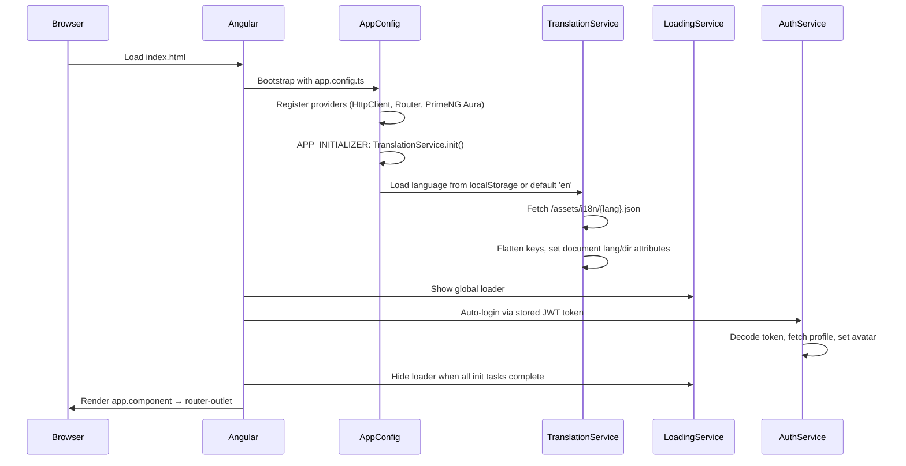
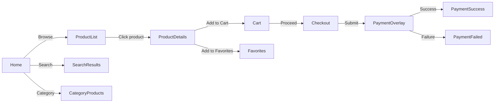
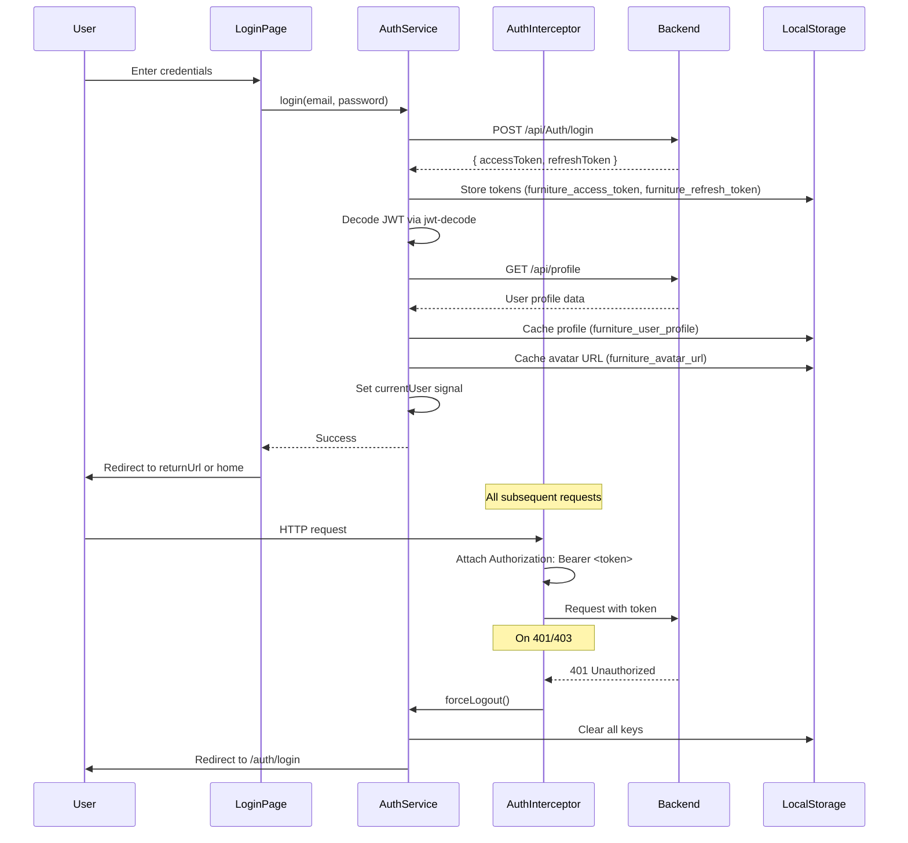
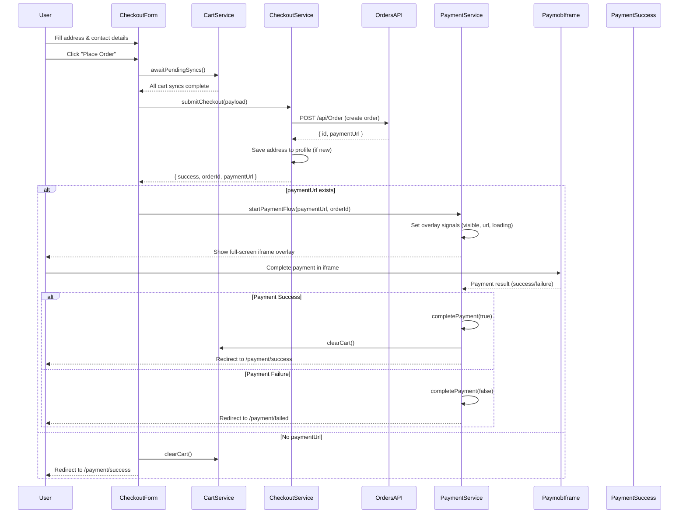
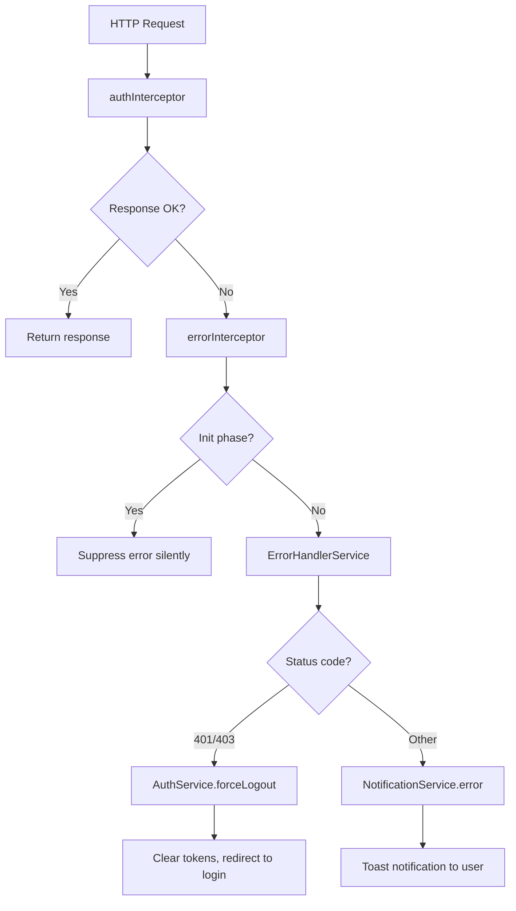
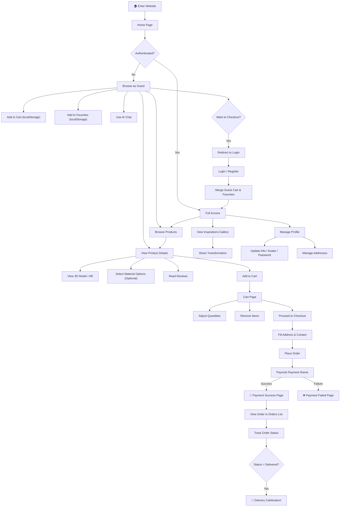

# HomeAI (FurniMind) — Project Documentation

> **Single Source of Truth** · Enterprise-Grade Technical Documentation
> Generated from codebase revision as of June 2026

---

## Table of Contents

| # | Section |
|---|---------|
| 1 | [Project Overview](#1-project-overview) |
| 2 | [System Architecture](#2-system-architecture) |
| 3 | [Technology Stack](#3-technology-stack) |
| 4 | [Folder Structure](#4-folder-structure) |
| 5 | [Application Flow](#5-application-flow) |
| 6 | [Feature Documentation](#6-feature-documentation) |
| 7 | [Pages Documentation](#7-pages-documentation) |
| 8 | [Shared Components](#8-shared-components) |
| 9 | [Core Layer](#9-core-layer) |
| 10 | [Routing Documentation](#10-routing-documentation) |
| 11 | [API Documentation](#11-api-documentation) |
| 12 | [Authentication Flow](#12-authentication-flow) |
| 13 | [State Management](#13-state-management) |
| 14 | [UI System](#14-ui-system) |
| 15 | [Localization](#15-localization) |
| 16 | [Payment Flow](#16-payment-flow) |
| 17 | [Error Handling](#17-error-handling) |
| 18 | [Project Features Catalog](#18-project-features-catalog) |
| 19 | [Reusable Business Rules](#19-reusable-business-rules) |
| 20 | [User Journey](#20-user-journey) |
| 21 | [Project Dependencies](#21-project-dependencies) |
| 22 | [Developer Onboarding Guide](#22-developer-onboarding-guide) |
| 23 | [Glossary](#23-glossary) |
| 24 | [Appendix](#24-appendix) |

---

# 1. Project Overview

## Project Name

**HomeAI** (branded as **FurniMind**)

## Business Idea

HomeAI is an AI-powered furniture e-commerce platform that connects customers with furniture workshops (vendors). The platform differentiates itself from traditional e-commerce by incorporating:

- **AI-powered chat assistant** that provides furniture recommendations through text and voice interaction.
- **3D product visualization** using `<model-viewer>` and Three.js for augmented-reality (AR) product previews.
- **Room scanning** capabilities that allow users to visualize furniture placement in their own spaces.
- **Before / after inspiration gallery** where users share room transformation stories.

## Project Purpose

To provide a bilingual (English / Arabic) furniture marketplace with an intelligent shopping experience — enabling customers to browse, customize, visualize, and purchase furniture online, while giving workshop vendors a dedicated dashboard to manage products, orders, materials, revenue analytics, and customer communication.

## Target Users

| Role | Description |
|------|-------------|
| **Customer** | Browses products, adds to cart / favorites, places orders, uses AI chat, views 3D models, shares inspirations. |
| **Vendor (Workshop)** | Manages product catalog, processes orders, configures materials & pricing options, views analytics & revenue. |
| **Admin** | Moderates products and reviews through the backend API (no dedicated admin frontend exists in this codebase). |

## Main Goals

1. Provide a seamless, bilingual furniture shopping experience.
2. Integrate AI-driven recommendations via chat (text + voice).
3. Enable immersive 3D / AR product visualization.
4. Offer a full-featured vendor dashboard for workshop management.
5. Process payments through the embedded Paymob payment gateway.
6. Deliver real-time order notifications via SignalR WebSockets.

## Technologies Used (Summary)

Angular 20 · TypeScript · Bootstrap 5 · PrimeNG 20 · RxJS 7 · Angular Signals · Three.js · model-viewer · SignalR · GSAP · Paymob · Google OAuth

---

# 2. System Architecture

## Frontend Architecture

HomeAI is a **single-page application (SPA)** built with Angular 20 using a **feature-based modular architecture**. The application is structured into three principal layers:

```
┌─────────────────────────────────────────────┐
│                 App Shell                    │
│  (app.component, app.config, app.routes)     │
├─────────────────────────────────────────────┤
│              Core Layer                      │
│  Guards · Interceptors · Services · Layouts  │
│  Constants · State · Utils                   │
├─────────────────────────────────────────────┤
│             Shared Layer                     │
│  Components · Directives · Pipes · Utils     │
│  i18n · Services                             │
├─────────────────────────────────────────────┤
│           Feature Modules (20)               │
│  about · addresses · ai · auth · cart        │
│  categories · checkout · contact · errors    │
│  favorites · home · inspirations             │
│  notifications · orders · payment · products │
│  profile · search · vendor · vendor-auth     │
└─────────────────────────────────────────────┘
```

## Feature-Based Architecture

Each feature module follows a consistent internal structure:

```
feature/
├── components/        # Feature-specific presentational components
├── data-access/       # API services, facades, mappers (where applicable)
├── interfaces/        # TypeScript interfaces and DTOs
├── models/            # Enums, constants, type definitions
├── pages/             # Routable page components
├── services/          # Feature-specific business logic services
├── store/             # Signal-based local stores (where applicable)
└── feature.routes.ts  # Lazy-loaded route definitions
```

## Routing Architecture

The application uses a **layout-based routing strategy** with four layout wrappers:

| Layout | Description | Guard |
|--------|-------------|-------|
| `MainLayoutComponent` | Customer-facing storefront with navbar + footer | `customerGuard` |
| `AuthLayoutComponent` | Authentication pages (login, register) | `guestGuard` |
| `VendorLayoutComponent` | Vendor dashboard workspace with sidebar | `vendorGuard` |
| `EmptyLayoutComponent` | Standalone pages (payment, errors) | None |

All feature modules are **lazy-loaded** via dynamic `import()` statements in route configurations.

## State Management

The application uses a **hybrid state management** approach:

- **Angular Signals** for reactive local and global state (`signal()`, `computed()`, `effect()`).
- **RxJS Observables** for asynchronous data streams, HTTP responses, and complex async operations.
- **localStorage** for client-side persistence of tokens, cart items, favorites, language preferences, and avatar URLs.

Two global state services exist:

| Service | Responsibility |
|---------|---------------|
| `AppState` | User identity (`currentUser`), feature flags, authentication computed state. |
| `UiState` | Global loading overlay (`globalLoading`), filter sidebar visibility (`sidebarVisible`), alert dispatch (`showAlert`). |

## Guards

| Guard | File | Purpose |
|-------|------|---------|
| `authGuard` | `auth.guard.ts` | Protects customer-only routes; redirects unauthenticated users to `/auth/login` with `returnUrl`. |
| `guestGuard` | `guest.guard.ts` | Prevents authenticated users from accessing guest pages (login/register); redirects to home or `returnUrl`. |
| `customerGuard` | `customer.guard.ts` | Blocks vendors from accessing the customer storefront; redirects vendors to `/vendor/dashboard`. |
| `vendorGuard` | `vendor.guard.ts` | Protects vendor workspace routes; redirects non-vendors to `/vendor/login` with `returnUrl`, customers to `/`. |
| `vendorAuthGuard` | `vendor-auth.guard.ts` | Prevents authenticated vendors from accessing vendor login/register; redirects to `/vendor/dashboard`. |

## Interceptors

| Interceptor | File | Purpose |
|-------------|------|---------|
| `authInterceptor` | `auth.interceptor.ts` | Attaches JWT `Authorization: Bearer <token>` header to all outgoing requests. Triggers session termination on 401/403 responses. |
| `errorInterceptor` | `error.interceptor.ts` | Catches HTTP errors globally, delegates to `ErrorHandlerService`. Suppresses errors during app initialization to prevent premature error toasts. |

## Payment Integration

Payments are processed through **Paymob** using an embedded iframe overlay. The `PaymentService` manages overlay state via signals (`isOverlayVisible`, `paymentUrl`, `orderId`, `isIframeLoading`) and communicates payment outcomes through an RxJS `Subject`.

## Localization

A custom signals-based `TranslationService` supports English and Arabic with full RTL/LTR switching. Language JSON files are loaded from `assets/i18n/`, flattened into dot-notation keys, and applied via a `translate` pipe and programmatic `t()` method.

---

# 3. Technology Stack

## Core Framework

| Technology | Version | Purpose |
|------------|---------|---------|
| Angular | 20.0.0 | Core SPA framework |
| TypeScript | ~5.8.2 | Static typing |
| RxJS | ~7.8.0 | Reactive programming |
| Zone.js | ~0.15.0 | Change detection |

## UI & Styling

| Technology | Version | Purpose |
|------------|---------|---------|
| Bootstrap | ^5.3.8 | Responsive CSS grid & utilities |
| PrimeNG | ^20.4.0 | UI component library (dropdowns, dialogs, tables) |
| @primeng/themes | ^20.4.0 | PrimeNG Aura theme preset |
| GSAP | ^3.13.0 | Advanced animations |
| Font Awesome | ^6.7.2 | Icon library |
| primeicons | ^7.0.0 | PrimeNG icon set |

## 3D / AR Visualization

| Technology | Version | Purpose |
|------------|---------|---------|
| Three.js | ^0.184.0 | 3D rendering engine |
| @google/model-viewer | ^4.3.1 | Web component for 3D/AR model display |

## Real-Time Communication

| Technology | Version | Purpose |
|------------|---------|---------|
| @microsoft/signalr | ^10.0.0 | WebSocket-based real-time notifications |

## Authentication

| Technology | Version | Purpose |
|------------|---------|---------|
| @angular/google-signin | (custom) | Google OAuth social login |
| jwt-decode | ^4.0.0 | JWT token decoding |

## Utility Libraries

| Technology | Version | Purpose |
|------------|---------|---------|
| canvas-confetti | ^1.9.3 | Delivery celebration animations |
| ngx-image-cropper | ^19.0.0 | Profile image cropping |
| ngx-skeleton-loader | ^9.0.0 | Content placeholder skeletons |
| quill / ngx-quill | ^2.0.7 / ^27.1.0 | Rich text editor (vendor descriptions) |
| swiper | ^11.2.8 | Touch-enabled carousels |

## Development Tools

| Technology | Version | Purpose |
|------------|---------|---------|
| Angular CLI | 20.0.0 | Build, serve, scaffold |
| Karma / Jasmine | ^6.4.4 / ~5.6.0 | Unit testing |

## Backend API

| Detail | Value |
|--------|-------|
| Base URL | `https://home-ai.runasp.net/api/` |
| Architecture | Onion Architecture (ASP.NET Core) |
| Authentication | JWT Bearer tokens |

---

# 4. Folder Structure

```
src/
├── app/
│   ├── core/                          # Singleton services, guards, interceptors
│   │   ├── constants/                 # App-wide constant definitions
│   │   │   ├── api-urls.ts            # REST API endpoint URL map
│   │   │   ├── app-routes.ts          # Centralized route path strings
│   │   │   ├── localstorage-keys.ts   # LocalStorage key constants
│   │   │   └── index.ts              # Barrel export
│   │   ├── guards/                    # Route guard functions
│   │   │   ├── auth.guard.ts          # Customer auth protection
│   │   │   ├── customer.guard.ts      # Vendor exclusion from storefront
│   │   │   ├── guest.guard.ts         # Authenticated user exclusion from auth pages
│   │   │   ├── vendor.guard.ts        # Vendor workspace protection
│   │   │   └── vendor-auth.guard.ts   # Vendor auth page protection
│   │   ├── interceptors/              # HTTP interceptor functions
│   │   │   ├── auth.interceptor.ts    # JWT token attachment
│   │   │   └── error.interceptor.ts   # Global error interception
│   │   ├── layouts/                   # Application layout wrappers
│   │   │   ├── auth-layout/           # Authentication pages layout
│   │   │   ├── empty-layout/          # Minimal pages layout
│   │   │   ├── main-layout/           # Customer storefront layout
│   │   │   └── vendor-layout/         # Vendor dashboard layout
│   │   ├── services/                  # Core singleton services
│   │   │   ├── auth-required.service.ts      # Auth-required dialog state
│   │   │   ├── delivery-celebration.service.ts# Delivery celebration modal
│   │   │   ├── error-handler.service.ts      # HTTP error notification dispatch
│   │   │   ├── loading.service.ts            # Global loading state manager
│   │   │   ├── notification-sound.service.ts # Audio playback for notifications
│   │   │   └── product-cache.service.ts      # In-memory product cache
│   │   ├── state/                     # Global state services
│   │   │   ├── app.state.ts           # User identity & feature flags
│   │   │   └── ui.state.ts            # Loading overlay & sidebar state
│   │   └── utils/                     # Core utility functions
│   │       └── api-utils.ts           # API response unwrapping & product normalization
│   │
│   ├── shared/                        # Reusable components, directives, pipes
│   │   ├── components/                # 22 shared UI components
│   │   │   ├── alert/                 ├── button/
│   │   │   ├── chatbot-widget/        ├── confirm-dialog/
│   │   │   ├── custom-dropdown/       ├── empty-state/
│   │   │   ├── footer/                ├── language-switcher/
│   │   │   ├── loading-spinner/       ├── modal/
│   │   │   ├── navbar/                ├── notfound/
│   │   │   ├── page-header/           ├── pagination/
│   │   │   ├── product-card/          ├── scroll-to-top/
│   │   │   ├── search-bar/            ├── section-title/
│   │   │   ├── skeleton-loader/       ├── status-badge/
│   │   │   ├── three-d-viewer/        └── toast/
│   │   ├── directives/                # Reusable directives
│   │   │   ├── auto-direction.directive.ts   # Automatic text direction
│   │   │   ├── click-outside.directive.ts    # Click outside detection
│   │   │   ├── debounce-click.directive.ts   # Click debouncing
│   │   │   ├── lazy-image.directive.ts       # Lazy image loading
│   │   │   └── rtl.directive.ts              # RTL class binding
│   │   ├── i18n/                      # Internationalization
│   │   │   └── translation.service.ts # Signals-based translation engine
│   │   ├── pipes/                     # Transform pipes
│   │   │   ├── currency-format.pipe.ts
│   │   │   ├── localized.pipe.ts
│   │   │   ├── notification-translation.pipe.ts
│   │   │   ├── safe-url.pipe.ts
│   │   │   ├── status-translation.pipe.ts
│   │   │   ├── translate.pipe.ts
│   │   │   └── truncate.pipe.ts
│   │   ├── services/                  # Shared services
│   │   │   └── notification.service.ts# Toast notification queue manager
│   │   └── utils/                     # Shared utility functions
│   │       ├── localized.ts           # Localized field accessor
│   │       └── price-utils.ts         # Price formatting utilities
│   │
│   ├── features/                      # 20 feature modules
│   │   ├── about/                     # About page
│   │   ├── addresses/                 # Address management
│   │   ├── ai/                        # AI chat, room scanner, result visualizer
│   │   ├── auth/                      # Customer authentication
│   │   ├── cart/                      # Shopping cart
│   │   ├── categories/                # Category browsing
│   │   ├── checkout/                  # Checkout flow
│   │   ├── contact/                   # Contact page
│   │   ├── errors/                    # Error pages
│   │   ├── favorites/                 # Wishlist / favorites
│   │   ├── home/                      # Homepage
│   │   ├── inspirations/              # Before/after gallery
│   │   ├── notifications/             # Real-time notification hub
│   │   ├── orders/                    # Order management
│   │   ├── payment/                   # Payment processing
│   │   ├── products/                  # Product listing & details
│   │   ├── profile/                   # User profile management
│   │   ├── search/                    # Product search
│   │   ├── vendor/                    # Vendor dashboard workspace
│   │   └── vendor-auth/               # Vendor authentication
│   │
│   ├── app.component.ts              # Root component
│   ├── app.config.ts                  # Application configuration & providers
│   └── app.routes.ts                  # Root route definitions
│
├── assets/
│   ├── i18n/                          # Language JSON files (en.json, ar.json)
│   ├── images/                        # Static images
│   └── sounds/                        # Notification audio files
│
├── environments/
│   ├── environment.ts                 # Development environment config
│   └── environment.prod.ts            # Production environment config
│
└── styles/                            # Global SCSS stylesheets
```

### Folder Responsibilities

| Folder | Purpose | Interaction |
|--------|---------|-------------|
| `core/` | Singleton services, guards, interceptors, layouts, and global state. Initialized once at app bootstrap. | Consumed by all feature modules and shared components. |
| `shared/` | Reusable, stateless UI components, pipes, directives, and the translation service. | Imported by feature modules as needed. Never imports from features. |
| `features/` | Self-contained, lazily-loaded business feature modules. Each owns its routes, services, pages, and interfaces. | May import from `core/` and `shared/`. Cross-feature imports are kept minimal (e.g., `auth` service used by `cart`). |
| `assets/` | Static resources: translation JSON files, images, audio files. | Loaded at runtime by services and components. |
| `environments/` | Build-time environment configuration (API URLs, feature flags, payment keys). | Injected into services at compile time. |

---

# 5. Application Flow

## App Initialization



### Initialization Sequence

1. **Bootstrap**: `app.config.ts` registers providers including `provideHttpClient` with `authInterceptor` and `errorInterceptor`, `provideRouter` with route definitions, and PrimeNG Aura theme preset.
2. **APP_INITIALIZER**: The `TranslationService.init()` method runs before the app becomes interactive. It reads the stored language from `localStorage` (key: `lang`), fetches the corresponding JSON translation file, flattens nested keys to dot-notation, and sets `document.documentElement.lang` and `dir` attributes.
3. **Global Loader**: `LoadingService` tracks pending initialization tasks through a counter signal. It subscribes to router navigation events and sets a 300ms minimum display time to prevent visual flicker.
4. **Auth Restoration**: `AuthService` checks for an existing JWT token in localStorage (key: `furniture_access_token`), decodes it via `jwt-decode`, fetches the user profile from `/api/profile`, and populates the `currentUser` signal.
5. **Cart Sync**: Once auth state becomes `true`, the `CartService` constructor's RxJS pipeline triggers `syncCartFromBackend()`, merging any guest cart items with the backend cart.

## Routing Flow

1. The router resolves the URL against `app.routes.ts`.
2. Each route group is wrapped in a layout component (`MainLayout`, `AuthLayout`, `VendorLayout`, `EmptyLayout`).
3. Guards run before route activation to check authentication, role, and guest status.
4. Feature modules are lazy-loaded on first navigation via `loadChildren` or `loadComponent`.

## API Communication

1. Feature services inject `HttpClient` and call backend endpoints defined in `API_URLS`.
2. The `authInterceptor` automatically attaches the JWT bearer token.
3. Responses are unwrapped using `unwrap<T>()` from `api-utils.ts`, which handles nested `{data: ...}`, `{result: ...}`, and direct response shapes.
4. Products are normalized using `normalizeProduct()` to ensure consistent field naming across varying backend response shapes.
5. On HTTP errors, the `errorInterceptor` delegates to `ErrorHandlerService`, which dispatches localized toast notifications.

## Error Flow

1. HTTP errors are caught by `errorInterceptor`.
2. `ErrorHandlerService.handleError()` maps status codes to user-friendly messages.
3. `AuthErrorHandler` provides detailed, bilingual (EN/AR) error messages for authentication-specific errors using a status-to-pattern dictionary.
4. Errors during app initialization are suppressed to prevent premature toast spam.
5. 401/403 errors trigger `AuthService.forceLogout()`, clearing tokens and redirecting to login.

---

# 6. Feature Documentation

## 6.1 Home Feature

### Purpose
Landing page showcasing featured products, categories, and promotional content.

### Routes
| Path | Component | Guard |
|------|-----------|-------|
| `/` | `HomeComponent` | `customerGuard` |

### Services
No dedicated service; uses `ProductService.getFeaturedProducts()` and `CategoryService.getCategories()`.

### Dependencies
`ProductService`, `CategoryService`, `TranslationService`

---

## 6.2 Auth Feature

### Purpose
Customer authentication — login, registration, password reset, and Google OAuth social login.

### Routes
| Path | Component | Guard |
|------|-----------|-------|
| `/auth/login` | `LoginComponent` | `guestGuard` |
| `/auth/register` | `RegisterComponent` | `guestGuard` |
| `/auth/forgot-password` | `ForgotPasswordComponent` | `guestGuard` |
| `/auth/reset-password` | `ResetPasswordComponent` | `guestGuard` |

### Services

**`AuthService`** (root-provided)
- Manages JWT tokens (access + refresh) in localStorage.
- Decodes tokens via `jwt-decode` to extract user claims.
- Provides `isAuthenticated`, `isLoggedIn`, `currentUser` signals.
- `login()`, `register()`, `googleLogin()`, `logout()`, `forceLogout()` methods.
- Fetches and caches user avatar from profile endpoint.
- Google OAuth uses client ID: `834738882064-e87ejpnt830djaabjh07uhhk626sanhe.apps.googleusercontent.com`.

**`AuthErrorHandler`**
- Maps HTTP status codes and backend error patterns to localized (EN/AR) user messages.
- Covers patterns for duplicate emails, invalid credentials, weak passwords, expired tokens, account locks, and more.

### Business Logic
- Tokens stored under keys `furniture_access_token` and `furniture_refresh_token`.
- User profile cached under `furniture_user_profile`.
- Avatar URL cached under `furniture_avatar_url`.
- On logout, all localStorage keys are cleared and the user is redirected to `/auth/login`.

---

## 6.3 Vendor Auth Feature

### Purpose
Separate authentication flow for workshop vendors.

### Routes
| Path | Component | Guard |
|------|-----------|-------|
| `/vendor/login` | `VendorLoginComponent` | `vendorAuthGuard` |
| `/vendor/register` | `VendorRegisterComponent` | `vendorAuthGuard` |

### Business Logic
- `vendorAuthGuard` prevents already-authenticated vendors from accessing login/register pages, redirecting them to `/vendor/dashboard`.

---

## 6.4 Products Feature

### Purpose
Product catalog browsing, search, filtering, details view, 3D model preview, reviews, and quick view modal.

### Routes
| Path | Component | Guard |
|------|-----------|-------|
| `/products` | `ProductListComponent` | `customerGuard` |
| `/products/:id` | `ProductDetailsComponent` | `customerGuard` |

### Services

**`ProductService`**
- `getProducts(filter?)` — Fetches product list with filtering (query, category, subcategory, vendor, price range, featured, new arrival, sort, pagination).
- `getProductsPaginated(filter?)` — Returns products with total count metadata for pagination.
- `getProductById(id)` — Fetches single product details.
- `getFeaturedProducts()` — Fetches featured products.
- `searchProducts(query)` — Keyword search across catalog.
- All responses are unwrapped and normalized via `normalizeProduct()`.

**`ReviewsService`**
- `getProductReviews(productId)` — Fetches reviews for a product.
- `getProductRating(productId)` — Fetches average rating and total count (cached in `ratingCache` Map).
- `addReview(review)` — Posts a new review.
- `deleteReview(id)` — Deletes a review.

**`QuickViewService`**
- Signal-based modal state (`isOpen`, `product` signals).
- `open(product)` / `close()` methods for the quick view overlay.

### Interfaces
`IProduct`, `IProductFilter`, `IReview`, `IProductImage`

### Business Logic
- Products are normalized to handle varying backend response shapes (different field names for images, prices, names).
- Pagination supports multiple backend total-count field names (`totalItems`, `totalCount`, `total`, `recordsTotal`, etc.).
- Product options (materials) are optional — users can add to cart without selecting any options.

---

## 6.5 Categories Feature

### Purpose
Category and subcategory browsing with hierarchical navigation.

### Routes
| Path | Component | Guard |
|------|-----------|-------|
| `/categories` | `CategoryListComponent` | `customerGuard` |
| `/categories/:id` | `CategoryProductsComponent` | `customerGuard` |

### Services

**`CategoryService`**
- `getCategories()` — Fetches all categories (cached in signal after first fetch).
- `getSubcategories(categoryId)` — Fetches subcategories (cached in Map).
- `getProductTypes(subCategoryId)` — Fetches product types for a subcategory.

---

## 6.6 Cart Feature

### Purpose
Shopping cart management with local persistence and backend synchronization.

### Routes
| Path | Component | Guard |
|------|-----------|-------|
| `/cart` | `CartComponent` | `customerGuard` |

### Services

**`CartStore`** (Signal-based store)
- Central state container holding `items` signal.
- Computed signals: `totalItems`, `subtotal`, `totalQuantity`, `totalPrice`, `shippingCost`, `taxAmount`, `discountAmount`, `grandTotal`.
- Persists to localStorage (key: `furniture_cart_items`) via an `effect()`.
- Constants: `SHIPPING_FEE = 0`, `TAX_RATE = 0.075` (defined but currently showing `shippingCost`, `taxAmount`, `discountAmount` as 0).

**`CartService`** (orchestrator)
- `addToCart(product, quantity, selectedOptionIds)` — Adds item with option price deltas, enforces `MAX_STOCK_LIMIT = 10`, shows success toast with "View Cart" link, triggers `CartSuccessService`.
- `removeFromCart(itemId)` — Removes item locally and syncs to backend.
- `updateQuantity(itemId, quantity)` — Debounced (300ms) quantity update with backend sync.
- `clearCart()` — Empties cart locally and syncs clear to backend.
- `syncCartFromBackend()` — Merges guest (local-only) items with backend cart on login.
- `awaitPendingSyncs()` — Flushes all pending debounced updates before checkout.
- Uses `activeSyncRequests` Set and `pendingUpdatePromises` Map to prevent duplicate sync operations.

**`CartApiService`**
- `getCart()`, `addItem()`, `updateItem()`, `removeItem()`, `clearCart()` — HTTP calls to cart endpoints.

**`CartSuccessService`**
- Manages the "Added to cart" success overlay state.

### Business Logic
- Guest users' cart is persisted to localStorage only.
- On login, local guest items are merged with the backend cart (items without `cartItemId` are treated as guest items).
- On logout, the cart is cleared locally.
- Material option price deltas are added to the base product price.
- Maximum 10 items of the same product allowed in cart.
- Quantity updates are debounced at 300ms to reduce API calls.
- Backend sync failures show a warning toast but do not block the UI.

---

## 6.7 Favorites Feature

### Purpose
Wishlist / saved products functionality with local and backend persistence.

### Routes
| Path | Component | Guard |
|------|-----------|-------|
| `/favorites` | `FavoritesComponent` | `customerGuard` |

### Services

**`FavoritesService`**
- `favorites` signal as the authoritative source.
- `getFavorites()` — Returns from localStorage (guest) or backend (authenticated).
- `addFavorite()` / `removeFavorite()` — Toggle favorite state.
- On login: merges guest favorites with backend favorites via `mergeGuestFavorites()`.
- On logout: clears favorites from localStorage and resets signal.

### Business Logic
- Guest favorites stored in localStorage (key: `furniture_favorites_list`).
- Authenticated users' favorites are synced to the backend.
- An `effect()` watches `authService.isAuthenticated()` to trigger sync/clear.

---

## 6.8 Checkout Feature

### Purpose
Order placement with address, contact details, and payment orchestration.

### Routes
| Path | Component | Guard |
|------|-----------|-------|
| `/checkout` | `CheckoutFormComponent` | `authGuard` |

### Services

**`CheckoutService`**
- `submitCheckout(payload)` — Creates an order via `OrdersApiService.createOrder()`, then saves the shipping address to the user's profile (if it doesn't already exist as a duplicate).
- Returns `ICheckoutResult` containing `success`, `orderId`, `paymentUrl`, `profileAddressSaved`.

### Interfaces
```typescript
interface ICheckoutPayload {
  address: string;
  phoneNumber: string;
  notes: string | null;
  items?: ICheckoutItem[];
  firstName?: string;
  lastName?: string;
  email?: string;
  phone?: string;
  addressLine1?: string;
  addressLine2?: string;
  city?: string;
  country?: string;
  paymentProvider?: 'paymob';
  orderNotes?: string;
  addressId?: string;
}
```

### Business Logic
- Before submitting, `CartService.awaitPendingSyncs()` flushes all pending cart operations.
- After order creation, the checkout address is saved to the user's profile if not a duplicate (matched by `addressLine1`, `city`, `country`).
- If a `paymentUrl` is returned, `PaymentService.startPaymentFlow()` opens the embedded Paymob iframe overlay.
- Cart is only cleared on successful payment completion.

---

## 6.9 Payment Feature

### Purpose
Payment processing via embedded Paymob iframe overlay and payment status pages.

### Routes
| Path | Component | Guard |
|------|-----------|-------|
| `/payment/processing` | `PaymentProcessingComponent` | None (EmptyLayout) |
| `/payment/success` | `PaymentSuccessComponent` | None (EmptyLayout) |
| `/payment/failed` | `PaymentFailedComponent` | None (EmptyLayout) |

### Services

**`PaymentService`**
- **Overlay State Signals**: `isOverlayVisible`, `paymentUrl`, `orderId`, `isIframeLoading`.
- `startPaymentFlow(paymentUrl, orderId)` — Opens the iframe overlay, returns an Observable that emits the payment result.
- `completePayment(success)` — Closes overlay and emits result.
- `cancelPayment()` — Closes overlay and emits failure.
- `createPaymobPayment(payload)` — POST to Paymob integration endpoint.
- `initiateMasterOrderPayment(payload)` — Initiates payment for a master order.
- `initiateVendorOrderPayment(payload)` — Initiates payment for a vendor order.
- `getMasterOrderRemainingBalance(id)` / `getVendorOrderRemainingBalance(id)` — Check remaining payment balance.
- `createPaymentIntent()` — Mock implementation returning a simulated payment intent.
- `processPayment()` — Mock implementation returning success.

### Payment Methods (defined in service)
| ID | Name | Provider |
|----|------|----------|
| `str_card` | Credit/Debit Card (Stripe) | stripe |
| `pp_wallet` | PayPal Wallet | paypal |
| `pm_wallet` | Mobile Wallet (Paymob) | paymob |

---

## 6.10 Orders Feature

### Purpose
Customer order listing, order details with status timeline, order modification, and cancellation.

### Routes
| Path | Component | Guard |
|------|-----------|-------|
| `/orders` | `OrdersListComponent` | `authGuard` |
| `/orders/:id` | `OrderDetailsComponent` | `authGuard` |

### Data Access Layer

**`OrdersApiService`**
- `getMyOrders()` — Fetches all user orders.
- `getOrderById(id)` — Fetches single order details.
- `createOrder(payload)` — Submits a new order (returns `id` + `paymentUrl`).
- `updateOrderStatus(id, status)` — Updates order status.
- `updateOrderItems(id, items)` — Updates item quantities on pending orders.
- `approveDeliveryDate(vendorOrderId)` / `rejectDeliveryDate(vendorOrderId)` — Customer approval/rejection of vendor-proposed delivery dates.

**`OrdersFacade`** (provided per-component, not root)
- Manages `orders`, `selectedOrder`, loading states (`isLoadingList`, `isLoadingDetails`, `isCancelling`, `isSaving`), and error keys.
- `loadOrders()` / `loadOrderDetails(id)` — Fetch and enrich orders with product data from `ProductCacheService`.
- `cancelOrder(id)` — Sets status to 'Cancelled', updates local state.
- `updateOrderItems(id, items)` — Saves item quantity changes.
- `timelineFor(order)` — Generates timeline step view models for the status progress component.
- `orderStatusTone()` / `paymentStatusTone()` — Maps statuses to badge color tones.
- `displayStatusFor(order)` — Resolves the display status considering terminal negative states and status history.

**`OrdersMapper`**
- `mapBackendToOrder()` — Transforms raw backend order structure to frontend `IOrder` interface.

### Order Status Lifecycle
```
pending → confirmed → in_progress → shipped → delivered
                                                  ↓
                                        cancelled / refunded / returned
```

Additional intermediate statuses: `awaiting_customer_approval`, `pending_payment`.

---

## 6.11 Profile Feature

### Purpose
User profile management — personal information, address book, avatar upload, password change.

### Routes
| Path | Component | Guard |
|------|-----------|-------|
| `/profile` | `ProfileComponent` | `authGuard` |

### Services

**`ProfileService`**
- `getProfile()` — Fetches user profile.
- `updateProfile(payload)` — Updates profile with sanitized addresses (temporary `addr_` prefixed IDs are stripped).
- `uploadProfileImage(file)` — Uploads avatar image via FormData.
- `changePassword(payload)` — Changes user password.

### Interfaces
`IProfile`, `IUpdateProfileDto`, `IChangePasswordDto`

---

## 6.12 Addresses Feature

### Purpose
Customer address CRUD operations.

### Services

**`AddressService`**
- Manages address list via signals.
- CRUD operations for customer shipping addresses.

---

## 6.13 AI Feature

### Purpose
AI-powered furniture recommendations through text/voice chat, room scanning, and result visualization.

### Routes
| Path | Component | Guard |
|------|-----------|-------|
| `/ai/chat` | `AiChatComponent` | `customerGuard` |
| `/ai/result` | `AiResultComponent` | `customerGuard` |
| `/ai/room-scanner` | `RoomScannerComponent` | `customerGuard` |

### Services

**`ChatService`** (real backend communication)
- `sendMessage(message, userId, conversationId)` — Sends text message to AI backend.
- `sendVoiceMessage(audioFile, userId, conversationId)` — Uploads voice recording via FormData to `/api/chat/voice`.
- Manages `conversationId` signal, `isLoading` signal, and `messages` signal.

**`AiService`** (mock/simulation layer)
- Contains a mock product database with furniture items.
- `getChatRecommendation(input)` — Simulates AI recommendations.
- `getHotspotMapping()` — Returns coordinate mappings for 3D scene interactivity.
- Manages material/wood property selection and placement suggestions.

### Business Logic
- Voice recording uses the browser's `MediaRecorder` API.
- Audio is captured as WebM format and uploaded via FormData.
- The chatbot widget supports both text and voice input modes with recording timer display.

---

## 6.14 Inspirations Feature

### Purpose
Community-driven before/after room transformation gallery.

### Routes
| Path | Component | Guard |
|------|-----------|-------|
| `/inspirations` | `InspirationsGalleryComponent` | `customerGuard` |
| `/inspirations/share` | `ShareTransformationComponent` | `authGuard` |

### Services

**`InspirationsService`**
- `getInspirations()` — Fetches gallery posts.
- `shareTransformation(formData)` — Submits a new before/after transformation via FormData.

### Business Logic
- Users upload before and after images via drag-and-drop or file selection.
- FormData includes images and transformation description.

---

## 6.15 Notifications Feature

### Purpose
Real-time push notifications via SignalR WebSocket connection.

### Services

**`NotificationHubService`**
- Connects to `${apiUrl}/hubs/notifications` via SignalR.
- Listens on the `ReceiveNotification` method.
- Pushes incoming notifications to `newNotifications$` Subject.
- Dispatches toast alerts via `NotificationService`.
- Manages connection lifecycle (start, stop, reconnect).

---

## 6.16 Search Feature

### Purpose
Product search with keyword queries.

### Routes
| Path | Component | Guard |
|------|-----------|-------|
| `/search` | `SearchResultsComponent` | `customerGuard` |

### Dependencies
Uses `ProductService.searchProducts(query)`.

---

## 6.17 Vendor Feature

### Purpose
Complete vendor dashboard workspace for workshop management.

### Routes
| Path | Component | Guard |
|------|-----------|-------|
| `/vendor/dashboard` | `VendorDashboardComponent` | `vendorGuard` |
| `/vendor/orders` | `VendorOrdersComponent` | `vendorGuard` |
| `/vendor/orders/:id` | `VendorOrderDetailsComponent` | `vendorGuard` |
| `/vendor/products` | `VendorProductsComponent` | `vendorGuard` |
| `/vendor/products/new` | `VendorProductFormComponent` | `vendorGuard` |
| `/vendor/products/:id/edit` | `VendorProductEditComponent` | `vendorGuard` |
| `/vendor/analytics` | `VendorAnalyticsComponent` | `vendorGuard` |
| `/vendor/materials` | `VendorMaterialsComponent` | `vendorGuard` |
| `/vendor/profile` | `VendorProfileComponent` | `vendorGuard` |
| `/vendor/notifications` | `VendorNotificationsComponent` | `vendorGuard` |
| `/vendor/reviews` | `VendorReviewsComponent` | `vendorGuard` |

### Services

**`VendorService`**
- `getOrders(filter)` — Paginated vendor order list with filtering.
- `getOrderById(orderId)` — Single order details.
- `updateOrderStatus(orderId, status)` — Change order status.
- `proposeDeliveryDate(orderId, date)` — Propose estimated delivery.
- `getDashboardMetrics()` — Dashboard KPI data.
- `getRevenue()` — Revenue statistics.
- `getAnalytics()` — Order analytics data.
- `getWorkshopProfile()` / `updateWorkshopProfile()` — Workshop profile CRUD.
- `uploadWorkshopLogo(file)` / `uploadProfileImage(file)` — Image uploads.
- `getNotifications()` / `getUnreadCount()` / `markAsRead()` / `markAllAsRead()` — Notification management.
- Material management: `getVendorMaterials()`, `createMaterial()`, `deleteMaterial()`, `updateMaterial()`, `createOption()`, `deleteOption()`, `updateOption()`.

**`VendorProductService`**
- `getVendorProducts(page, size, filters)` — Fetches vendor's own products with pagination and filters (search, category, subcategory, product type, active status, sort).
- Signals: `products`, `totalCount`, `filteredCount`, `activeCount`, `inactiveCount`, `pageNumber`, `pageSize`, `totalPages`, `hasNextPage`, `hasPreviousPage`.

**`VendorOrdersService`** — Vendor-specific order operations.

**`VendorOrderAnalyticsService`** — Order analytics data processing.

**`VendorRevenueService`** — Revenue statistics processing.

**`VendorReviewsService`** — Vendor review management.

**`VendorNotificationStateService`** — Vendor notification state management.

### Data Access Layer
The vendor feature has a dedicated `data-access/` directory with:
- DTOs: `vendor-orders-filter-request.dto.ts`, `vendor-orders-filter-response.dto.ts`, `vendor-order-details.dto.ts`, `vendor-dashboard-metrics.dto.ts`, `vendor-revenue-statistics.dto.ts`, `vendor-order-analytics.dto.ts`, `vendor-profile-response.dto.ts`, `vendor-profile-request.dto.ts`, `vendor-notifications-response.dto.ts`, `unread-count.dto.ts`
- Mappers: `vendor-order.mapper.ts`, `vendor-revenue.mapper.ts`, `vendor-profile.mapper.ts`, `vendor-notification.mapper.ts`

---

## 6.18 About Feature

### Purpose
Static about page describing the platform.

### Routes
| Path | Component | Guard |
|------|-----------|-------|
| `/about` | `AboutComponent` | `customerGuard` |

---

## 6.19 Contact Feature

### Purpose
Contact page with form for user inquiries.

### Routes
| Path | Component | Guard |
|------|-----------|-------|
| `/contact` | `ContactComponent` | `customerGuard` |

---

## 6.20 Errors Feature

### Purpose
Error pages (404, 500, etc.).

### Routes
| Path | Component | Guard |
|------|-----------|-------|
| `**` | `NotFoundComponent` | None |

---

# 7. Pages Documentation

## Customer-Facing Pages

| Page | Route | Layout | Key Components | API Calls |
|------|-------|--------|----------------|-----------|
| Home | `/` | Main | Featured products carousel, category grid, hero section | `GET products?isFeatured=true`, `GET categories` |
| Product List | `/products` | Main | Product cards, filter sidebar, pagination, search bar | `GET products` (paginated) |
| Product Details | `/products/:id` | Main | Image gallery, 3D viewer, material options, reviews, add-to-cart | `GET products/:id`, `GET reviews/product/:id` |
| Categories | `/categories` | Main | Category cards with subcategory links | `GET categories`, `GET subcategories/:id` |
| Cart | `/cart` | Main | Cart item list, quantity controls, price summary, checkout button | Cart state (signals) |
| Favorites | `/favorites` | Main | Favorited product cards, remove toggle | `GET favorites`, `DELETE favorites/:id` |
| Checkout | `/checkout` | Main | Address form, contact details, order summary, payment trigger | `POST orders`, `PUT profile` |
| Orders List | `/orders` | Main | Order cards with status badges | `GET orders` |
| Order Details | `/orders/:id` | Main | Status timeline, item list, delivery date approval, cancel button | `GET orders/:id`, `PUT orders/:id/status` |
| Profile | `/profile` | Main | Profile form, avatar upload, password change, address book | `GET profile`, `PUT profile`, `PUT profile/image` |
| AI Chat | `/ai/chat` | Main | Chat message list, text input, voice recorder, AI responses | `POST chat/message`, `POST chat/voice` |
| Room Scanner | `/ai/room-scanner` | Main | Camera/upload interface for room scanning | AI scanning endpoints |
| AI Result | `/ai/result` | Main | 3D visualization of recommended furniture placement | AI result data |
| Inspirations | `/inspirations` | Main | Gallery grid of before/after transformations | `GET inspirations` |
| Share Transformation | `/inspirations/share` | Main | Before/after image upload with description | `POST inspirations` (FormData) |
| Search Results | `/search` | Main | Product cards from search query | `GET products?query=...` |
| About | `/about` | Main | Static about content | None |
| Contact | `/contact` | Main | Contact form | Contact API |

## Auth Pages

| Page | Route | Layout | Guard |
|------|-------|--------|-------|
| Login | `/auth/login` | Auth | `guestGuard` |
| Register | `/auth/register` | Auth | `guestGuard` |
| Forgot Password | `/auth/forgot-password` | Auth | `guestGuard` |
| Reset Password | `/auth/reset-password` | Auth | `guestGuard` |
| Vendor Login | `/vendor/login` | Empty | `vendorAuthGuard` |
| Vendor Register | `/vendor/register` | Empty | `vendorAuthGuard` |

## Vendor Pages

| Page | Route | Layout | Key Features |
|------|-------|--------|-------------|
| Dashboard | `/vendor/dashboard` | Vendor | KPI metrics, recent orders, revenue summary |
| Orders | `/vendor/orders` | Vendor | Paginated order list with filters and status updates |
| Order Details | `/vendor/orders/:id` | Vendor | Order items, status management, delivery date proposal |
| Products | `/vendor/products` | Vendor | Product list with search, filter, active/inactive toggle |
| New Product | `/vendor/products/new` | Vendor | Product creation form with image upload |
| Edit Product | `/vendor/products/:id/edit` | Vendor | Product editing form |
| Analytics | `/vendor/analytics` | Vendor | Order analytics charts |
| Materials | `/vendor/materials` | Vendor | Material group and option CRUD management |
| Profile | `/vendor/profile` | Vendor | Workshop profile editing, logo upload |
| Notifications | `/vendor/notifications` | Vendor | Notification list with read/unread state |
| Reviews | `/vendor/reviews` | Vendor | Customer reviews management |

## Payment Pages

| Page | Route | Layout |
|------|-------|--------|
| Payment Processing | `/payment/processing` | Empty |
| Payment Success | `/payment/success` | Empty |
| Payment Failed | `/payment/failed` | Empty |

---

# 8. Shared Components

| Component | Selector | Purpose | Key Inputs | Used By |
|-----------|----------|---------|------------|---------|
| `AlertComponent` | `app-alert` | Inline alert banner | `type`, `message`, `action` | Various pages |
| `ButtonComponent` | `app-button` | Styled button with loading state | `label`, `loading`, `disabled`, `type` | All features |
| `ChatbotWidgetComponent` | `app-chatbot-widget` | Floating AI chat assistant | — | Main layout (global) |
| `ConfirmDialogComponent` | `app-confirm-dialog` | Centered modal confirmation dialog | `title`, `message`, `confirmText`, `cancelText` | Vendor pages, order management |
| `CustomDropdownComponent` | `app-custom-dropdown` | Styled dropdown select | `options`, `selected`, `placeholder` | Filter panels |
| `EmptyStateComponent` | `app-empty-state` | Empty data placeholder | `icon`, `title`, `message`, `actionLabel` | Lists (orders, favorites, cart) |
| `FooterComponent` | `app-footer` | Site footer | — | Main layout |
| `LanguageSwitcherComponent` | `app-language-switcher` | EN/AR language toggle | — | Navbar, vendor sidebar |
| `LoadingSpinnerComponent` | `app-loading-spinner` | Centered loading indicator | `size`, `overlay` | Various pages |
| `ModalComponent` | `app-modal` | Reusable modal wrapper | `isOpen`, `title`, `closeable` | Product quick-view, confirmations |
| `NavbarComponent` | `app-navbar` | Main navigation bar | — | Main layout |
| `NotfoundComponent` | `app-notfound` | 404 page content | — | Error routes |
| `PageHeaderComponent` | `app-page-header` | Page title with breadcrumbs | `title`, `breadcrumbs` | Feature pages |
| `PaginationComponent` | `app-pagination` | Page navigation controls | `currentPage`, `totalPages`, `pageChange` | Product list, vendor orders |
| `ProductCardComponent` | `app-product-card` | Product display card | `product`, `showActions` | Product list, home, favorites |
| `ScrollToTopComponent` | `app-scroll-to-top` | Floating scroll-to-top button | — | Main layout |
| `SearchBarComponent` | `app-search-bar` | Search input with suggestions | `placeholder`, `searchChange` | Navbar, product list |
| `SectionTitleComponent` | `app-section-title` | Styled section heading | `title`, `subtitle` | Home, category pages |
| `SkeletonLoaderComponent` | `app-skeleton-loader` | Content placeholder skeleton | `type`, `count` | Loading states |
| `StatusBadgeComponent` | `app-status-badge` | Colored status pill | `status`, `tone` | Order lists |
| `ThreeDViewerComponent` | `app-three-d-viewer` | 3D model viewer with AR | `modelSrc`, `poster`, `enableAR` | Product details |
| `ToastComponent` | `app-toast` | Toast notification stack | — | Global (via NotificationService) |

---

# 9. Core Layer

## Constants

### `api-urls.ts`
Centralized REST API endpoint URL map organized by domain:

| Group | Key Endpoints |
|-------|---------------|
| `AUTH` | `login`, `register`, `google-login`, `refresh-token`, `forgot-password`, `reset-password` |
| `PRODUCTS` | `LIST`, `DETAILS(id)`, `FEATURED`, `SEARCH`, `CATEGORIES`, `SUBCATEGORIES(id)`, `PRODUCT_TYPES(id)` |
| `CART` | `GET`, `ADD`, `UPDATE(id)`, `REMOVE(id)`, `CLEAR` |
| `ORDERS` | `LIST`, `DETAILS(id)`, `CREATE`, `UPDATE_STATUS(id)`, `UPDATE_ITEMS(id)` |
| `PROFILE` | `GET`, `UPDATE`, `IMAGE_UPLOAD`, `CHANGE_PASSWORD` |
| `PAYMENTS` | `PAYMOB`, `INITIATE_MASTERORDER`, `INITIATE_VENDORORDER`, `MASTERORDER_REMAINING_BALANCE(id)`, `VENDORORDER_REMAINING_BALANCE(id)` |
| `VENDOR` | `ORDERS_FILTER`, `ORDER_DETAILS(id)`, `UPDATE_ORDER_STATUS(id)`, `DASHBOARD_METRICS`, `REVENUE_ANALYTICS`, `ORDERS_ANALYTICS`, `PROFILE`, `UPLOAD_LOGO`, `MATERIALS`, `CREATE_GROUP`, `DELETE_GROUP(id)`, `ADD_OPTION(id)`, `DELETE_OPTION(id)`, `NOTIFICATIONS`, `NOTIFICATIONS_UNREAD_COUNT`, `NOTIFICATION_READ(id)`, `NOTIFICATIONS_READ_ALL` |

### `app-routes.ts`
Defines `APP_ROUTES` (string path constants) and `NAV_ROUTES` (full navigation paths used in programmatic routing).

### `localstorage-keys.ts`
| Key Constant | localStorage Key | Purpose |
|-------------|-----------------|---------|
| `ACCESS_TOKEN` | `furniture_access_token` | JWT access token |
| `REFRESH_TOKEN` | `furniture_refresh_token` | JWT refresh token |
| `USER` | `furniture_user_profile` | Cached user profile |
| `THEME` | `furniture_theme_mode` | Theme preference |
| `LANGUAGE` | `furniture_language` | Language preference |
| `CART` | `furniture_cart_items` | Cart items JSON |
| `FAVORITES` | `furniture_favorites_list` | Favorites JSON |
| `AVATAR_URL` | `furniture_avatar_url` | Cached avatar URL |

## Guards

See [Section 2 — Guards](#guards) for detailed descriptions.

## Interceptors

See [Section 2 — Interceptors](#interceptors) for detailed descriptions.

## Services

### `LoadingService`
- **Signal-based loading state** combining three sources: router navigation, pending async tasks, and manual triggers.
- `addInitTask()` — Registers a pending task, returns a completion callback.
- `show()` / `hide()` — Manual loading control.
- Enforces a **300ms minimum display time** to eliminate visual flicker.
- Subscribes to `NavigationStart`, `NavigationEnd`, `NavigationCancel`, `NavigationError` router events.

### `ErrorHandlerService`
- `handleError(error)` — Maps HTTP error status codes to notification types and dispatches toast alerts via `NotificationService`.

### `AuthRequiredService`
- Manages an "auth required" dialog for unauthenticated actions.
- Signal-based state: `dialogState` containing `visible`, `reason`, `title`, `message`, `returnUrl`, `confirmText`, `cancelText`.
- Supports reasons: `login`, `role`, `subscription`, `blocked`, `guest-checkout`.
- `requestAuthRequired(returnUrl, reason)` — Returns Observable that resolves when user confirms/cancels.

### `ProductCacheService`
- In-memory product cache with in-flight deduplication.
- `getProduct(id)` — Returns cached product or fetches from API (deduplicates concurrent requests via `share()`).
- `getProducts(ids)` — Batch-fetches multiple products.
- `clearCache()` — Clears all cached entries.

### `NotificationSoundService`
- Plays `assets/sounds/notification.mp3` on notification receipt.
- Manages `isMuted` signal for user mute toggle.
- Unlocks browser audio API on first user interaction (`click`, `touchstart`, `keydown`).

### `DeliveryCelebrationService`
- Triggers a celebration modal (with confetti via `canvas-confetti`) when an order reaches `delivered` status.
- Uses localStorage flags to prevent repeated celebrations for the same order.
- Filters delivered orders and compares against previously celebrated order IDs.

## Layouts

| Layout | Component | Features |
|--------|-----------|----------|
| `MainLayoutComponent` | Customer storefront wrapper | Navbar, footer, chatbot widget, scroll-to-top, toast stack, global loader, payment overlay |
| `AuthLayoutComponent` | Authentication pages wrapper | Minimal layout for login/register forms |
| `VendorLayoutComponent` | Vendor dashboard wrapper | Desktop sidebar navigation, current user display, language switcher, `<router-outlet>` |
| `EmptyLayoutComponent` | Standalone pages wrapper | No chrome — used for payment processing, error pages |

## Global State

### `AppState`
```typescript
interface IUserState {
  id: string;
  name: string;
  email: string;
  isAuthenticated: boolean;
}
```
- `currentUser` signal — Holds current user identity.
- `featureFlags` signal — Reads from `environment.featureFlags`.
- `isAuthenticated` computed — Derived from `currentUser().isAuthenticated`.
- `setUser()` / `clearUser()` — Update user state.

### `UiState`
- `globalLoading` signal — Controls the full-page loading overlay.
- `sidebarVisible` signal — Controls the filter sidebar visibility.
- `activeAlert` signal — Legacy alert state (now routed to `NotificationService`).
- `showAlert(type, message, action?)` — Dispatches alerts through `NotificationService` by type.
- `toggleSidebar()` — Toggles filter sidebar.

## Utilities

### `api-utils.ts`
- `unwrap<T>(response)` — Recursively unwraps API response envelopes (`{data: ...}`, `{result: ...}`, `{value: ...}`).
- `normalizeProduct(raw)` — Maps varying backend product response shapes to a consistent `IProduct` interface, handling differences in field names for images, prices, names (EN/AR), categories, materials, dimensions, and vendor information.

---

# 10. Routing Documentation

## Main Routes (app.routes.ts)

```mermaid
graph TD
    A["/"] --> B["MainLayout (customerGuard)"]
    B --> C["/ — Home"]
    B --> D["/products — Product List"]
    B --> E["/products/:id — Product Details"]
    B --> F["/categories — Categories"]
    B --> G["/cart — Cart"]
    B --> H["/favorites — Favorites"]
    B --> I["/orders — Orders"]
    B --> J["/orders/:id — Order Details"]
    B --> K["/checkout — Checkout"]
    B --> L["/profile — Profile"]
    B --> M["/inspirations — Inspirations"]
    B --> N["/ai — AI Module"]
    B --> O["/search — Search"]
    B --> P["/about — About"]
    B --> Q["/contact — Contact"]

    R["/auth"] --> S["AuthLayout (guestGuard)"]
    S --> T["/auth/login"]
    S --> U["/auth/register"]
    S --> V["/auth/forgot-password"]
    S --> W["/auth/reset-password"]

    X["/vendor"] --> Y["VendorLayout (vendorGuard)"]
    Y --> Z["/vendor/dashboard"]
    Y --> AA["/vendor/orders"]
    Y --> AB["/vendor/products"]
    Y --> AC["/vendor/analytics"]
    Y --> AD["/vendor/materials"]
    Y --> AE["/vendor/profile"]
    Y --> AF["/vendor/notifications"]
    Y --> AG["/vendor/reviews"]

    AH["EmptyLayout"] --> AI["/vendor/login (vendorAuthGuard)"]
    AH --> AJ["/vendor/register (vendorAuthGuard)"]
    AH --> AK["/payment/processing"]
    AH --> AL["/payment/success"]
    AH --> AM["/payment/failed"]
```



## Lazy Loading

All feature modules use Angular's lazy loading via `loadChildren` or `loadComponent`:

```typescript
// Example from app.routes.ts
{
  path: 'products',
  loadChildren: () => import('./features/products/products.routes')
    .then(m => m.PRODUCTS_ROUTES)
}
```

## Navigation Flow



---

# 11. API Documentation

## Base URL

```
https://home-ai.runasp.net/api/
```

## Authentication Endpoints

| Method | Endpoint | Auth | Purpose |
|--------|----------|------|---------|
| POST | `Auth/login` | No | Customer login |
| POST | `Auth/register` | No | Customer registration |
| POST | `Auth/google-login` | No | Google OAuth login |
| POST | `Auth/refresh-token` | No | Token refresh |
| POST | `Auth/forgot-password` | No | Password reset request |
| POST | `Auth/reset-password` | No | Password reset execution |

## Product Endpoints

| Method | Endpoint | Auth | Purpose |
|--------|----------|------|---------|
| GET | `Products` | No | List products (paginated, filterable) |
| GET | `Products/{id}` | No | Product details |
| GET | `Products/featured` | No | Featured products |
| GET | `Products/search` | No | Search products by keyword |
| GET | `Categories` | No | List all categories |
| GET | `Categories/{id}/subcategories` | No | Subcategories for a category |
| GET | `SubCategories/{id}/product-types` | No | Product types for a subcategory |

## Cart Endpoints

| Method | Endpoint | Auth | Purpose |
|--------|----------|------|---------|
| GET | `Cart` | Yes | Get user's cart |
| POST | `Cart/items` | Yes | Add item to cart |
| PUT | `Cart/items/{id}` | Yes | Update item quantity |
| DELETE | `Cart/items/{id}` | Yes | Remove item from cart |
| DELETE | `Cart` | Yes | Clear entire cart |

## Order Endpoints

| Method | Endpoint | Auth | Purpose |
|--------|----------|------|---------|
| GET | `Order` | Yes | List user's orders |
| GET | `Order/{id}` | Yes | Order details |
| POST | `Order` | Yes | Create new order |
| PUT | `Order/{id}/status` | Yes | Update order status |
| PUT | `Order/{id}/items` | Yes | Update order items |
| PUT | `Order/vendor-orders/{id}/approve` | Yes | Approve delivery date |
| PUT | `Order/vendor-orders/{id}/reject` | Yes | Reject delivery date |

## Profile Endpoints

| Method | Endpoint | Auth | Purpose |
|--------|----------|------|---------|
| GET | `profile` | Yes | Get user profile |
| PUT | `profile` | Yes | Update user profile |
| PUT | `profile/image` | Yes | Upload profile image |
| PUT | `profile/change-password` | Yes | Change password |

## Payment Endpoints

| Method | Endpoint | Auth | Purpose |
|--------|----------|------|---------|
| POST | `payments/paymob` | Yes | Create Paymob payment |
| POST | `payments/masterorder/initiate` | Yes | Initiate master order payment |
| POST | `payments/vendororder/initiate` | Yes | Initiate vendor order payment |
| GET | `payments/masterorder/{id}/remaining-balance` | Yes | Check master order balance |
| GET | `payments/vendororder/{id}/remaining-balance` | Yes | Check vendor order balance |

## Vendor Endpoints

| Method | Endpoint | Auth | Purpose |
|--------|----------|------|---------|
| POST | `VendorOrders/orders/filter` | Yes | Filtered vendor order list |
| GET | `VendorOrders/orders/{id}` | Yes | Vendor order details |
| PUT | `VendorOrders/orders/{id}/status` | Yes | Update vendor order status |
| PUT | `VendorOrders/orders/{id}/propose-date` | Yes | Propose delivery date |
| GET | `VendorOrders/dashboard/metrics` | Yes | Dashboard KPIs |
| GET | `VendorOrders/revenue/analytics` | Yes | Revenue statistics |
| GET | `VendorOrders/orders/analytics` | Yes | Order analytics |
| GET | `Workshop/profile` | Yes | Get workshop profile |
| PUT | `Workshop/profile` | Yes | Update workshop profile |
| PUT | `Workshop/profile/logo` | Yes | Upload workshop logo |
| GET | `Products/my-products` | Yes | Vendor's own products |
| GET | `VendorMaterials` | Yes | Get vendor materials |
| POST | `VendorMaterials/Groups` | Yes | Create material group |
| DELETE | `VendorMaterials/Groups/{id}` | Yes | Delete material group |
| PUT | `VendorMaterials/Groups/{id}` | Yes | Update material group |
| POST | `VendorMaterials/Groups/{id}/Options` | Yes | Add material option |
| DELETE | `VendorMaterials/Options/{id}` | Yes | Delete material option |
| PUT | `VendorMaterials/Options/{id}` | Yes | Update material option |
| GET | `Notifications` | Yes | Get vendor notifications |
| GET | `Notifications/unread-count` | Yes | Get unread notification count |
| PUT | `Notifications/{id}/read` | Yes | Mark notification as read |
| PUT | `Notifications/read-all` | Yes | Mark all as read |

## Review Endpoints

| Method | Endpoint | Auth | Purpose |
|--------|----------|------|---------|
| GET | `Reviews/product/{id}` | No | Get product reviews |
| GET | `Reviews/product/{id}/rating` | No | Get product rating stats |
| POST | `Reviews` | Yes | Add a review |
| DELETE | `Reviews/{id}` | Yes | Delete a review |

## Chat / AI Endpoints

| Method | Endpoint | Auth | Purpose |
|--------|----------|------|---------|
| POST | `chat/message` | Yes | Send text message |
| POST | `chat/voice` | Yes | Send voice message (FormData) |

## Real-Time (SignalR)

| Hub URL | Method | Direction |
|---------|--------|-----------|
| `/hubs/notifications` | `ReceiveNotification` | Server → Client |

---

# 12. Authentication Flow



### Token Storage
| Key | Value | Purpose |
|-----|-------|---------|
| `furniture_access_token` | JWT string | Bearer authentication |
| `furniture_refresh_token` | JWT string | Token renewal |
| `furniture_user_profile` | JSON string | Cached user profile |
| `furniture_avatar_url` | URL string | Cached profile avatar |

### Google OAuth Flow
1. User clicks "Sign in with Google" button.
2. Google OAuth popup authenticates the user.
3. The Google ID token is sent to `POST /api/Auth/google-login`.
4. Backend validates the token and returns JWT access/refresh tokens.
5. Standard token storage and profile fetch flow follows.
6. Google Client ID: `834738882064-e87ejpnt830djaabjh07uhhk626sanhe.apps.googleusercontent.com`

### Route Protection
- **Customer routes**: Protected by `authGuard` — redirects to `/auth/login?returnUrl=<current>`.
- **Guest routes**: Protected by `guestGuard` — redirects authenticated users to home or `returnUrl`.
- **Vendor routes**: Protected by `vendorGuard` — redirects non-vendors to `/vendor/login`, customers to `/`.
- **Vendor auth pages**: Protected by `vendorAuthGuard` — redirects authenticated vendors to `/vendor/dashboard`.

### Session Termination
- On 401 or 403 HTTP responses, `authInterceptor` calls `AuthService.forceLogout()`.
- `forceLogout()` clears all localStorage keys, resets the `currentUser` signal, and redirects to the login page.

---

# 13. State Management

## Approach
The application uses a **signals-first** approach with RxJS for asynchronous operations.

## Global State

| State Service | Owner | Signals | Scope |
|---------------|-------|---------|-------|
| `AppState` | `core/state/` | `currentUser`, `featureFlags`, `isAuthenticated` (computed) | App-wide user identity & feature toggles |
| `UiState` | `core/state/` | `globalLoading`, `sidebarVisible`, `activeAlert` | App-wide UI state |
| `LoadingService` | `core/services/` | `isLoading` (readonly), `pendingTasks`, `isNavigating`, `manualLoading` | Global loading overlay |

## Feature-Level State

| Service | Owner | Signals | Scope |
|---------|-------|---------|-------|
| `CartStore` | `features/cart/store/` | `items`, `totalItems`, `subtotal`, `totalQuantity`, `shippingCost`, `taxAmount`, `grandTotal` | Cart state (persisted to localStorage) |
| `CartService` | `features/cart/services/` | `loadingStates` (per-item action states) | Cart operations & sync state |
| `FavoritesService` | `features/favorites/services/` | `favorites` | Wishlist items |
| `AuthService` | `features/auth/services/` | `isAuthenticated`, `currentUser`, `avatarUrl` | Authentication state |
| `TranslationService` | `shared/i18n/` | `currentLang`, `translations` | Active language & translation map |
| `ProductService` | `features/products/services/` | `products` | Product list cache |
| `CategoryService` | `features/categories/services/` | `categories` | Category list cache |
| `VendorProductService` | `features/vendor/services/` | `products`, `totalCount`, `filteredCount`, `activeCount`, `inactiveCount`, `pageNumber`, `pageSize`, `totalPages`, `hasNextPage`, `hasPreviousPage` | Vendor product pagination |
| `QuickViewService` | `features/products/services/` | `isOpen`, `product` | Quick view modal state |
| `PaymentService` | `features/payment/services/` | `isOverlayVisible`, `paymentUrl`, `orderId`, `isIframeLoading`, `paymentMethods` | Payment overlay state |
| `NotificationSoundService` | `core/services/` | `isMuted` | Audio mute toggle |
| `AuthRequiredService` | `core/services/` | `dialogState` | Auth required dialog state |

## RxJS Usage

| Pattern | Where Used |
|---------|-----------|
| `Observable` streams | All HTTP service methods return `Observable<T>` |
| `Subject` / `BehaviorSubject` | `NotificationHubService.newNotifications$`, `PaymentService.paymentResult$` |
| `toObservable()` | Converting signals to observables for RxJS pipelines (e.g., cart auth sync) |
| `switchMap`, `map`, `tap`, `catchError`, `finalize` | Standard data transformation and error handling in service methods |
| `firstValueFrom()` | Converting observables to promises in cart sync operations |
| `takeUntilDestroyed()` | Automatic subscription cleanup tied to component/service lifecycle |
| `distinctUntilChanged()` | Preventing duplicate auth state change reactions |

## localStorage Persistence

| Key | Owner | Data |
|-----|-------|------|
| `furniture_access_token` | `AuthService` | JWT access token |
| `furniture_refresh_token` | `AuthService` | JWT refresh token |
| `furniture_user_profile` | `AuthService` | Serialized user profile |
| `furniture_avatar_url` | `AuthService` | Avatar image URL |
| `furniture_cart_items` | `CartStore` | Serialized cart items array |
| `furniture_favorites_list` | `FavoritesService` | Serialized favorites array |
| `furniture_language` | `TranslationService` | Language code (`en` or `ar`) |
| `furniture_theme_mode` | (defined, usage varies) | Theme preference |
| `lang` | `TranslationService` | Language code (legacy key) |

---

# 14. UI System

## Layouts

The application uses four layout wrappers to provide different chrome for different user contexts:

| Layout | Components Included | Usage |
|--------|-------------------|-------|
| **MainLayout** | Navbar, Footer, ChatbotWidget, ScrollToTop, Toast stack, Global loader, Payment overlay | All customer-facing pages |
| **AuthLayout** | Minimal branding | Login, register, password forms |
| **VendorLayout** | Desktop sidebar, User info, Language switcher | All vendor dashboard pages |
| **EmptyLayout** | None | Payment processing, standalone error pages |

## Responsive Behavior
- Bootstrap 5 grid system for responsive layouts.
- Vendor sidebar collapses on smaller screens.
- Product grid adapts from 4 columns (desktop) to 1 column (mobile).
- Navigation bar includes a mobile hamburger menu.

## Design System

### Typography
- Primary font: System font stack via Bootstrap defaults.
- RTL support: `dir="rtl"` attribute set dynamically on `<html>` element.

### Icons
- Font Awesome 6 (`@fortawesome/fontawesome-free`)
- PrimeIcons (`primeicons`)

### Animations
- **GSAP**: Used for advanced animations and transitions.
- **CSS transitions**: Used for hover effects, modal entrances, toast slides.
- **canvas-confetti**: Delivery celebration particle effects.

## Loading System

### Global Page Loader
- Managed by `LoadingService`.
- Shown during route navigation and pending async tasks.
- 300ms minimum display duration to prevent flicker.
- FurniMind branded logo with golden shimmer/pulsing glow animation.

### Skeleton Loaders
- `ngx-skeleton-loader` provides content placeholder skeletons during data fetching.

### Per-Item Loading States
- Cart items track individual `adding`, `updating`, `removing` states via `loadingStates` signal in `CartService`.

## Toast Notification System

### Architecture
- **`NotificationService`**: Toast queue manager.
  - Maximum **3 visible toasts** simultaneously.
  - **Duplicate cooldown**: 800ms suppression window for identical messages.
  - **Auto-dismiss**: 3500ms timeout per toast.
  - Types: `success`, `error`, `warning`, `info`.
  - Each toast can include an optional action with `label` and `routerLink`.
- **`ToastComponent`**: Renders the toast stack with entrance/exit animations.

### Notification Sound
- `NotificationSoundService` plays `assets/sounds/notification.mp3`.
- Audio context is unlocked on first user interaction (click/touch/keydown).
- Users can toggle mute via `isMuted` signal.

## Modals
- `ConfirmDialogComponent`: Centered, viewport-locked overlay with backdrop blur, fade-and-scale animation, scroll lock.
- `ModalComponent`: Reusable modal wrapper.
- Payment iframe overlay: Full-screen overlay with embedded Paymob iframe.
- Auth required dialog: Login prompt modal managed by `AuthRequiredService`.
- Delivery celebration modal: Triggered on order delivery with confetti animation.

---

# 15. Localization

## Supported Languages

| Language | Code | Direction | Default |
|----------|------|-----------|---------|
| English | `en` | LTR | ✅ |
| Arabic | `ar` | RTL | — |

## Translation System

The application uses a custom **signals-based `TranslationService`** (not a third-party library).

### How It Works

1. **Initialization**: `TranslationService.init()` runs as an `APP_INITIALIZER`.
2. **Language Detection**: Reads from `localStorage` (key: `lang`), defaults to `en`.
3. **File Loading**: Fetches `/assets/i18n/{lang}.json` via HTTP.
4. **Key Flattening**: Nested JSON keys are flattened to dot-notation (e.g., `nav.home` → `"Home"`).
5. **Signal Update**: `translations` signal is set with the flattened map; `currentLang` signal updated.
6. **DOM Update**: Sets `document.documentElement.lang` and `dir` attributes (`ltr` for EN, `rtl` for AR).
7. **Backend Sync**: On language change, the preferred language is synchronized to the backend profile via `PUT /api/profile`.

### Translation Access

| Method | Usage |
|--------|-------|
| `translate` pipe | Template: `{{ 'key' \| translate }}` |
| `t(key)` method | Programmatic: `this.translationService.t('key')` |
| `localized(obj, field, lang)` | Utility: Returns `obj.fieldEn` or `obj.fieldAr` based on language |
| `LocalizedPipe` | Template: `{{ product \| localized:'name' }}` |

### RTL/LTR Switching
- `dir` attribute on `<html>` is set to `rtl` for Arabic, `ltr` for English.
- `AutoDirectionDirective` automatically sets text direction based on content.
- `RtlDirective` applies RTL-specific CSS classes.

### Language Persistence
- Stored in localStorage under key `lang`.
- Synced to backend user profile (`preferredLanguage` field).

---

# 16. Payment Flow



### Payment Provider
**Paymob** is the primary payment gateway.

### Payment Overlay State (Signals)
| Signal | Type | Purpose |
|--------|------|---------|
| `isOverlayVisible` | `boolean` | Controls iframe overlay visibility |
| `paymentUrl` | `string \| null` | URL loaded in the iframe |
| `orderId` | `number \| null` | Current order being paid |
| `isIframeLoading` | `boolean` | Iframe loading spinner state |

### Payment Result Flow
1. `startPaymentFlow()` opens the overlay and returns an Observable.
2. The iframe communicates payment outcome to the parent window.
3. `completePayment(success)` or `cancelPayment()` closes the overlay and emits the result.
4. Cart is cleared only on successful payment.
5. User is redirected to `/payment/success` or `/payment/failed`.

### Additional Payment Operations
- `initiateMasterOrderPayment()` — Initiates payment for a combined master order.
- `initiateVendorOrderPayment()` — Initiates payment for a specific vendor order.
- `getMasterOrderRemainingBalance()` / `getVendorOrderRemainingBalance()` — Check outstanding balance.

---

# 17. Error Handling

## Architecture



## Error Layers

### HTTP Interceptor Layer
- `errorInterceptor` catches all HTTP errors globally.
- During app initialization, errors are **suppressed** to prevent premature toast notifications.
- After initialization, errors are forwarded to `ErrorHandlerService`.

### Error Handler Service
- `ErrorHandlerService.handleError(error)` dispatches error notifications through `NotificationService`.
- Maps HTTP status codes to appropriate severity levels.

### Auth Error Handler
- `AuthErrorHandler` provides detailed, bilingual error messages for authentication-specific errors.
- Maps status codes and backend error message patterns to localized (EN/AR) user-facing messages.
- Covers: duplicate emails, invalid credentials, weak passwords, expired tokens, account locks, rate limiting, validation errors, and more.

### Component-Level Error Handling
- Services use `catchError()` in RxJS pipelines to handle API errors gracefully.
- Components display error states via `EmptyStateComponent` when data loading fails.
- `OrdersFacade` uses `listErrorKey` and `detailsErrorKey` signals to track error states.

## Empty States
- `EmptyStateComponent` provides visual feedback when lists are empty (no orders, no favorites, empty cart).
- Includes icon, title, message, and optional action button.

## Fallback Pages
- `NotFoundComponent` (`/404` or `**` wildcard) — Displayed for unmatched routes.
- Error pages in the `errors` feature module.

---

# 18. Project Features Catalog

| # | Feature | Description | Status | Pages | Key APIs |
|---|---------|-------------|--------|-------|----------|
| 1 | **Home** | Landing page with featured products and categories | Active | 1 | Products, Categories |
| 2 | **Auth** | Customer login, register, password reset, Google OAuth | Active | 4 | Auth endpoints |
| 3 | **Vendor Auth** | Vendor login and registration | Active | 2 | Auth endpoints |
| 4 | **Products** | Product catalog, details, 3D viewer, reviews | Active | 2 | Products, Reviews |
| 5 | **Categories** | Category browsing with subcategories | Active | 2 | Categories |
| 6 | **Cart** | Shopping cart with local persistence and backend sync | Active | 1 | Cart endpoints |
| 7 | **Favorites** | Wishlist with guest/authenticated sync | Active | 1 | Favorites endpoints |
| 8 | **Checkout** | Order placement with address and payment | Active | 1 | Orders, Profile, Payments |
| 9 | **Payment** | Embedded Paymob iframe payment processing | Active | 3 | Payments |
| 10 | **Orders** | Order listing, details, status timeline, cancellation | Active | 2 | Orders |
| 11 | **Profile** | User profile, avatar, password, addresses | Active | 1 | Profile |
| 12 | **Addresses** | Address management | Active | — | Profile |
| 13 | **AI Chat** | AI-powered furniture recommendation chat (text + voice) | Active | 1 | Chat endpoints |
| 14 | **Room Scanner** | Room scanning for furniture visualization | Active | 1 | AI endpoints |
| 15 | **AI Result** | 3D visualization of AI recommendations | Active | 1 | AI endpoints |
| 16 | **Inspirations** | Before/after transformation gallery | Active | 2 | Inspirations |
| 17 | **Search** | Product search by keyword | Active | 1 | Products |
| 18 | **Notifications** | Real-time SignalR push notifications | Active | — | SignalR hub |
| 19 | **Vendor Dashboard** | Workshop KPI metrics and overview | Active | 1 | Vendor metrics |
| 20 | **Vendor Orders** | Vendor order management and status updates | Active | 2 | Vendor orders |
| 21 | **Vendor Products** | Vendor product CRUD with pagination | Active | 3 | Vendor products |
| 22 | **Vendor Analytics** | Order and revenue analytics | Active | 1 | Vendor analytics |
| 23 | **Vendor Materials** | Material groups and options CRUD | Active | 1 | VendorMaterials |
| 24 | **Vendor Profile** | Workshop profile and logo management | Active | 1 | Workshop profile |
| 25 | **Vendor Notifications** | Vendor notification management | Active | 1 | Notifications |
| 26 | **Vendor Reviews** | Customer review management | Active | 1 | Reviews |
| 27 | **About** | Static about page | Active | 1 | None |
| 28 | **Contact** | Contact form | Active | 1 | Contact |
| 29 | **Errors** | Error pages (404) | Active | 1 | None |

---

# 19. Reusable Business Rules

## Cart Rules

| Rule | Implementation |
|------|---------------|
| Maximum stock limit per product: **10 items** | `CartService.addToCart()` checks `newQty > MAX_STOCK_LIMIT` |
| Quantity must be ≥ 1 | Invalid quantities show localized error toast |
| Quantity of 0 triggers removal | `updateQuantity()` calls `removeFromCart()` if `cleanQty <= 0` |
| Quantity updates debounced at **300ms** | `updateQuantityDebounceTimers` Map in `CartService` |
| Guest cart persisted to localStorage | `CartStore` writes to `furniture_cart_items` via `effect()` |
| Cart synced to backend on login | `syncCartFromBackend()` merges guest items with backend cart |
| Cart cleared on logout | Auth subscription in `CartService` constructor |
| Duplicate sync prevention | `activeSyncRequests` Set prevents concurrent syncs for same item |
| Material option price deltas added to base price | `addToCart()` calculates `basePrice + optionPrice` |
| Product options are optional | Cart accepts items with no selected options |

## Favorites Rules

| Rule | Implementation |
|------|---------------|
| Guest favorites stored in localStorage | Key: `furniture_favorites_list` |
| Merge guest favorites on login | `mergeGuestFavorites()` in `FavoritesService` |
| Clear favorites on logout | `effect()` watching `authService.isAuthenticated()` |

## Checkout Rules

| Rule | Implementation |
|------|---------------|
| Pending cart syncs flushed before checkout | `CartService.awaitPendingSyncs()` called before submit |
| New address saved to profile if non-duplicate | Duplicate check by `addressLine1`, `city`, `country` (case-insensitive) |
| Temporary address IDs stripped before API call | IDs starting with `addr_` are removed from the payload |
| Cart cleared only on successful payment | `clearCart()` called after payment success signal |

## Authentication Rules

| Rule | Implementation |
|------|---------------|
| JWT tokens stored in localStorage | Keys: `furniture_access_token`, `furniture_refresh_token` |
| 401/403 triggers forced logout | `authInterceptor` calls `AuthService.forceLogout()` |
| Vendors blocked from customer storefront | `customerGuard` checks role and redirects |
| Customers blocked from vendor workspace | `vendorGuard` redirects customers to `/` |
| Authenticated users blocked from auth pages | `guestGuard` redirects to home or `returnUrl` |
| Authenticated vendors blocked from vendor auth pages | `vendorAuthGuard` redirects to `/vendor/dashboard` |

## Order Rules

| Rule | Implementation |
|------|---------------|
| Only pending orders can be modified/cancelled | `OrdersFacade.canModifyOrder` computed checks `status === 'pending'` |
| Terminal negative statuses show prior status in timeline | `displayStatusFor()` resolves `oldStatus` from history |
| Intermediate statuses mapped to 'pending' for timeline | `awaiting_customer_approval` and `pending_payment` → `pending` |
| Order list sorted by creation date (newest first) | `orderListVm` computed sorts by `createdAt` descending |

## Notification Rules

| Rule | Implementation |
|------|---------------|
| Maximum 3 visible toasts | `NotificationService.maxVisible = 3` |
| Duplicate suppression cooldown: **800ms** | `NotificationService` duplicate check window |
| Auto-dismiss after **3500ms** | `NotificationService` auto-dismiss timer |
| Audio unlocked on first user interaction | `NotificationSoundService` listens for `click`/`touchstart`/`keydown` |

## Delivery Celebration Rules

| Rule | Implementation |
|------|---------------|
| Celebration triggered on `delivered` status | `DeliveryCelebrationService` monitors order status |
| Same-order celebration prevented | localStorage flag tracks celebrated order IDs |

---

# 20. User Journey



### Detailed Customer Journey

1. **Landing**: Customer arrives at the home page featuring promoted products and categories.
2. **Browsing**: Customer explores products by category, search, or featured sections.
3. **Product Exploration**: Customer views product details including image gallery, 3D model preview (with AR capability), available material options, and customer reviews.
4. **Cart Building**: Customer adds products to cart (optionally selecting material options). Material price deltas adjust the total. Guest users' carts persist in localStorage.
5. **Authentication**: When the customer proceeds to checkout, authentication is required. Guest cart and favorites are merged with the backend on login.
6. **Checkout**: Customer fills in shipping address and contact details. The address is saved to their profile if it's new.
7. **Payment**: The Paymob iframe overlay opens for payment processing. The customer completes payment within the iframe.
8. **Order Confirmation**: On successful payment, the cart is cleared and the customer is redirected to the success page.
9. **Order Tracking**: Customer views their orders with status timeline progression (Pending → Confirmed → In Progress → Shipped → Delivered).
10. **Delivery**: When an order reaches "Delivered" status, a celebration modal with confetti animation is triggered.
11. **Engagement**: Customer can share before/after room transformations in the inspirations gallery, interact with the AI chat assistant, and manage their profile.

---

# 21. Project Dependencies

## Feature Dependency Map

```mermaid
graph TD
    subgraph Core
        AppState
        UiState
        LoadingService
        ErrorHandler[ErrorHandlerService]
        AuthInterceptor[authInterceptor]
        ErrorInterceptor[errorInterceptor]
        ProductCache[ProductCacheService]
        NotifSound[NotificationSoundService]
        DeliveryCelebration[DeliveryCelebrationService]
        AuthRequired[AuthRequiredService]
    end

    subgraph Shared
        TranslationService
        NotificationService
        ThreeDViewer[ThreeDViewerComponent]
        ChatbotWidget[ChatbotWidgetComponent]
        ProductCard[ProductCardComponent]
        Toast[ToastComponent]
    end

    subgraph Features
        Auth[AuthService]
        Cart[CartService]
        Favorites[FavoritesService]
        Products[ProductService]
        Categories[CategoryService]
        Orders[OrdersFacade]
        Checkout[CheckoutService]
        Payment[PaymentService]
        Profile[ProfileService]
        Vendor[VendorService]
        AI[ChatService / AiService]
        Inspirations[InspirationsService]
        NotifHub[NotificationHubService]
    end

    Auth --> AppState
    Auth --> UiState
    Cart --> Auth
    Cart --> UiState
    Cart --> TranslationService
    Favorites --> Auth
    Favorites --> TranslationService
    Checkout --> Orders
    Checkout --> Cart
    Checkout --> Profile
    Orders --> ProductCache
    Orders --> LoadingService
    Payment --> UiState
    Products --> TranslationService
    Vendor --> Auth
    AI --> TranslationService
    NotifHub --> NotificationService
    NotifHub --> NotifSound
    DeliveryCelebration --> Orders
    AuthRequired --> Auth
```



## Service → Service Dependencies

| Service | Depends On |
|---------|-----------|
| `CartService` | `CartStore`, `CartApiService`, `AuthService`, `UiState`, `TranslationService`, `CartSuccessService` |
| `CheckoutService` | `OrdersApiService`, `CartService`, `ProfileService` |
| `OrdersFacade` | `OrdersApiService`, `ProductCacheService`, `LoadingService` |
| `FavoritesService` | `AuthService`, `TranslationService` |
| `NotificationHubService` | `NotificationService`, `NotificationSoundService` |
| `DeliveryCelebrationService` | Order status monitoring, localStorage |
| `PaymentService` | HTTP client, `API_URLS` |
| `VendorService` | HTTP client, `API_URLS`, various mapper functions |

---

# 22. Developer Onboarding Guide

## Prerequisites

| Tool | Version |
|------|---------|
| Node.js | 20+ (LTS recommended) |
| npm | 10+ |
| Angular CLI | 20.0.0 |
| Git | Latest |

## Getting Started

```bash
# Clone the repository
git clone <repository-url>
cd HomeAi_Angular

# Install dependencies
npm install

# Start development server
ng serve
# or
npm start

# Open in browser
# http://localhost:4200
```

## Important Entry Points

| File | Purpose |
|------|---------|
| `src/app/app.config.ts` | Application bootstrap configuration, providers, interceptors |
| `src/app/app.routes.ts` | Root route definitions with layout grouping |
| `src/app/app.component.ts` | Root component |
| `src/environments/environment.ts` | API base URL, feature flags, payment keys |

## Where to Add New Features

1. Create a new directory under `src/app/features/<feature-name>/`.
2. Follow the standard feature structure: `pages/`, `components/`, `services/`, `interfaces/`, `models/`, `<feature>.routes.ts`.
3. Define routes in `<feature>.routes.ts` and add lazy-loaded entry in `app.routes.ts`.
4. Use services from `core/` and components from `shared/` as needed.
5. Never import from another feature module's internal files — use shared services or core state instead.

## Coding Conventions

| Convention | Details |
|-----------|---------|
| **State Management** | Use Angular signals for local/reactive state; RxJS for async HTTP operations. |
| **Component Architecture** | Standalone components (no NgModules). |
| **File Naming** | Kebab-case: `product-card.component.ts`, `cart.service.ts`. |
| **Interface Naming** | Prefix with `I`: `IProduct`, `ICartItem`, `IOrder`. |
| **Guard Style** | Functional guards (not class-based). |
| **Interceptor Style** | Functional interceptors. |
| **Localization** | All user-facing strings use the `translate` pipe or `t()` method. |
| **API Response Handling** | Always unwrap responses via `unwrap<T>()` utility. |
| **Product Normalization** | Always normalize products via `normalizeProduct()`. |
| **Error Handling** | Use `catchError()` in RxJS pipelines; delegate to `ErrorHandlerService` for HTTP errors. |
| **Route Protection** | Apply appropriate guards based on user role requirements. |

## Key Files Reference

| Area | Key Files |
|------|-----------|
| **API endpoints** | `src/app/core/constants/api-urls.ts` |
| **Route paths** | `src/app/core/constants/app-routes.ts` |
| **Storage keys** | `src/app/core/constants/localstorage-keys.ts` |
| **API utilities** | `src/app/core/utils/api-utils.ts` |
| **Translation** | `src/app/shared/i18n/translation.service.ts` |
| **Auth logic** | `src/app/features/auth/services/auth.service.ts` |
| **Cart logic** | `src/app/features/cart/services/cart.service.ts` |
| **Environment** | `src/environments/environment.ts` |

---

# 23. Glossary

| Term | Definition |
|------|-----------|
| **Vendor / Workshop** | A furniture maker or workshop that lists and sells products through the platform. |
| **Customer** | An end user who browses, shops, and purchases furniture. |
| **Master Order** | A combined order that may span multiple vendors, each with their own vendor order. |
| **Vendor Order** | A sub-order within a master order specific to one vendor/workshop. |
| **Material Group** | A category of customization options for a product (e.g., "Wood Type", "Fabric Color"). |
| **Material Option** | A specific choice within a material group (e.g., "Oak", "Walnut") with an optional price delta. |
| **Price Delta** | The additional cost added to a product's base price when a specific material option is selected. |
| **Guest Cart** | Cart items stored in localStorage for unauthenticated users, merged with backend cart upon login. |
| **Quick View** | A modal overlay that displays product summary without navigating to the full details page. |
| **Inspiration** | A before/after room transformation post shared by a community member. |
| **Room Scanner** | An AI-powered feature that scans a room image and suggests furniture placements. |
| **SignalR Hub** | A WebSocket connection endpoint for real-time server-to-client notifications. |
| **Paymob** | The payment gateway provider used for processing credit card and mobile wallet payments. |
| **Onion Architecture** | The backend's architectural pattern with layered separation of concerns (used by the ASP.NET Core API). |
| **APP_INITIALIZER** | Angular provider token that runs initialization logic before the application starts accepting user interaction. |
| **Facade Pattern** | Used in the orders feature (`OrdersFacade`) to provide a simplified interface to complex subsystems. |
| **Barrel Export** | An `index.ts` file that re-exports from multiple files for cleaner import paths. |

---

# 24. Appendix

## A. Environment Configuration

### Development (`environment.ts`)
```typescript
export const environment = {
  production: false,
  apiUrl: 'https://home-ai.runasp.net/api/',
  featureFlags: {
    enableAiRecommendations: true,
    enableNewCheckout: true,
    enableNotifications: true
  },
  payment: {
    stripePublicKey: 'pk_test_placeholder',
    paypalClientId: 'paypal_client_id_placeholder',
    paymobApiKey: 'paymob_api_key_placeholder'
  },
  localization: {
    defaultLanguage: 'en',
    supportedLanguages: ['en', 'ar']
  },
  googleClientId: '834738882064-e87ejpnt830djaabjh07uhhk626sanhe.apps.googleusercontent.com'
};
```

## B. LocalStorage Keys Map

| Constant | Key | Type |
|----------|-----|------|
| `ACCESS_TOKEN` | `furniture_access_token` | JWT string |
| `REFRESH_TOKEN` | `furniture_refresh_token` | JWT string |
| `USER` | `furniture_user_profile` | JSON |
| `THEME` | `furniture_theme_mode` | string |
| `LANGUAGE` | `furniture_language` | `"en"` \| `"ar"` |
| `CART` | `furniture_cart_items` | JSON array |
| `FAVORITES` | `furniture_favorites_list` | JSON array |
| `AVATAR_URL` | `furniture_avatar_url` | URL string |

## C. Complete Route Map

### Customer Routes (MainLayout)
| Route | Guard | Lazy Module |
|-------|-------|-------------|
| `/` | `customerGuard` | `home` |
| `/products` | `customerGuard` | `products` |
| `/products/:id` | `customerGuard` | `products` |
| `/categories` | `customerGuard` | `categories` |
| `/categories/:id` | `customerGuard` | `categories` |
| `/cart` | `customerGuard` | `cart` |
| `/favorites` | `customerGuard` | `favorites` |
| `/checkout` | `authGuard` | `checkout` |
| `/orders` | `authGuard` | `orders` |
| `/orders/:id` | `authGuard` | `orders` |
| `/profile` | `authGuard` | `profile` |
| `/ai/chat` | `customerGuard` | `ai` |
| `/ai/result` | `customerGuard` | `ai` |
| `/ai/room-scanner` | `customerGuard` | `ai` |
| `/inspirations` | `customerGuard` | `inspirations` |
| `/inspirations/share` | `authGuard` | `inspirations` |
| `/search` | `customerGuard` | `search` |
| `/about` | `customerGuard` | `about` |
| `/contact` | `customerGuard` | `contact` |

### Auth Routes (AuthLayout)
| Route | Guard |
|-------|-------|
| `/auth/login` | `guestGuard` |
| `/auth/register` | `guestGuard` |
| `/auth/forgot-password` | `guestGuard` |
| `/auth/reset-password` | `guestGuard` |

### Vendor Routes (VendorLayout)
| Route | Guard |
|-------|-------|
| `/vendor/dashboard` | `vendorGuard` |
| `/vendor/orders` | `vendorGuard` |
| `/vendor/orders/:id` | `vendorGuard` |
| `/vendor/products` | `vendorGuard` |
| `/vendor/products/new` | `vendorGuard` |
| `/vendor/products/:id/edit` | `vendorGuard` |
| `/vendor/analytics` | `vendorGuard` |
| `/vendor/materials` | `vendorGuard` |
| `/vendor/profile` | `vendorGuard` |
| `/vendor/notifications` | `vendorGuard` |
| `/vendor/reviews` | `vendorGuard` |

### Standalone Routes (EmptyLayout)
| Route | Guard |
|-------|-------|
| `/vendor/login` | `vendorAuthGuard` |
| `/vendor/register` | `vendorAuthGuard` |
| `/payment/processing` | None |
| `/payment/success` | None |
| `/payment/failed` | None |
| `**` (wildcard) | None |

## D. Shared Pipes Reference

| Pipe | Selector | Purpose |
|------|----------|---------|
| `TranslatePipe` | `translate` | Translates a key using `TranslationService` |
| `LocalizedPipe` | `localized` | Returns localized field (EN/AR) from an object |
| `CurrencyFormatPipe` | `currencyFormat` | Formats numbers as currency |
| `SafeUrlPipe` | `safeUrl` | Bypasses Angular's URL sanitization for trusted URLs |
| `TruncatePipe` | `truncate` | Truncates long strings with ellipsis |
| `StatusTranslationPipe` | `statusTranslation` | Translates order/payment status labels |
| `NotificationTranslationPipe` | `notificationTranslation` | Translates notification messages |

## E. Shared Directives Reference

| Directive | Selector | Purpose |
|-----------|----------|---------|
| `AutoDirectionDirective` | `[appAutoDirection]` | Automatically sets text `dir` attribute based on content script |
| `ClickOutsideDirective` | `[appClickOutside]` | Emits event when user clicks outside the host element |
| `DebounceClickDirective` | `[appDebounceClick]` | Debounces rapid click events |
| `LazyImageDirective` | `[appLazyImage]` | Lazy-loads images using Intersection Observer |
| `RtlDirective` | `[appRtl]` | Applies RTL-specific CSS classes |

## F. Team

| Name | Role |
|------|------|
| **Ahmed Adam** | Full Stack Lead |
| **Saleh** | Full Stack Developer |
| **Sultan** | Full Stack Developer |
| **Mayar** | Full Stack Developer |
| **Ashraf** | Full Stack Developer |
| **Ayat** | Full Stack Developer |

---

> *This documentation was generated as the single source of truth for the HomeAI (FurniMind) project. It documents the project exactly as it currently exists in the codebase.*
